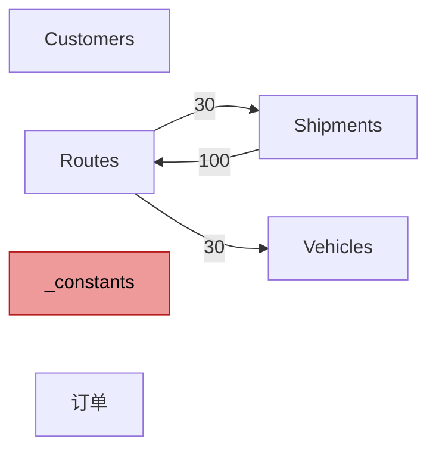
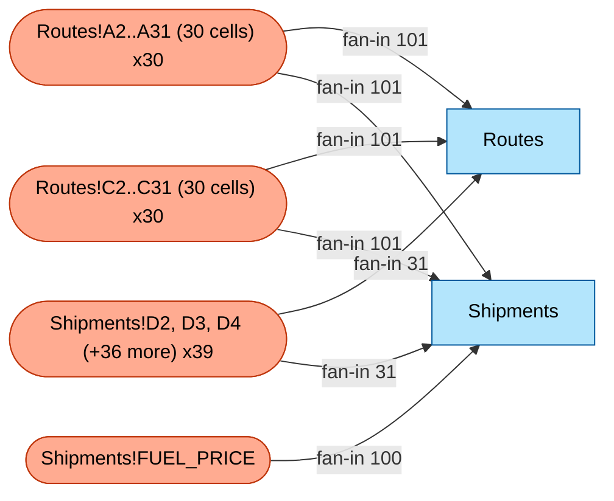

# Audit-Bericht — `logistics_routing_synth.xlsm` (Audit v0.1.0)

> Kennzahl: Komplexität **68/100**, **4** systemrelevante Zelle(n), **99** Code-Geruch-Befund(e).
>
> Tier-1-Audit. Reine statische Analyse — keine KI, kein Excel, keine Makro-Ausführung.
> Gleiche Eingabe ergibt stets gleiche Ausgabe. Befunde nach Rang sortiert, nicht interpretiert.

## Zusammenfassung

- **Komplexitätswert: 68 / 100** — mittlere Komplexität — spürbarer Refactoring-Aufwand.
- **Meistreferenzierte Zellgruppe**: `Routes!A2..A31 (30 cells)` (30 Zellen, Eingangsgrad 101). Jede Zelle steuert 101 Berechnungen.
- **Top-Code-Geruch**: `multiple-references` bei `Routes!A10` (Metrik=101, Schweregrad=high).
- **Erkannte Domäne**: `logistics-routing` _(Konfidenz: medium, Treffer: routes, shipments, vehicles_).
- **Operative Einstiegspunkte**: 1 Schaltfläche(n), 0 Ereignishandler. Siehe Arbeitsablauf-Leitfaden für die Schritt-für-Schritt-Beschreibung.
- **Risikoflags**: 1 streng-ausgeblendete(s) Blatt/Blätter.

**Komplexitäts-Teilbewertungen:**

| Teilbewertung | Wert | Balken |
|---|---|---|
| data scale | 18/20 | `█████████░` |
| formula depth | 0/20 | `░░░░░░░░░░` |
| metadata complexity | 10/20 | `█████░░░░░` |
| smell density | 20/20 | `██████████` |
| vba mass | 20/20 | `██████████` |

## Inhaltsverzeichnis

- [Zusammenfassung](#executive-summary)
- [Arbeitsablauf-Leitfaden](#workflow-guide)
- [Datenfluss-Story](#data-flow-story)
- [Wichtigste Auswirkungs-Befunde](#top-impact-findings)
- [VBA-Modul-Durchgang](#vba-module-walkthrough)
- [Domänenspezifische Befunde](#domain-specific-findings)
- [Referenz-Anhang](#reference-appendix)
- [Glossar](#glossary)
- [Methodik](#methodology)

## Arbeitsablauf-Leitfaden

_Abgeleitet aus der VBA-Struktur der Arbeitsmappe und den eingebetteten Formularsteuerelement-Schaltflächen (keine KI). So wird die Arbeitsmappe operativ verwendet._

_**Was das bedeutet**: die folgenden Schritte beschreiben die Sequenz, der ein Anwender folgt — typischerweise: Arbeitsmappe öffnen, Eingaben eingeben, Schaltfläche(n) klicken, Ergebniszellen lesen. Dies ist eine strukturelle Inferenz; semantische Erläuterung (z. B. "dies berechnet die Kapazitätsauslastung") würde Track-B-LLM-Anreicherung erfordern._

<!-- LLM-AUGMENT: workflow-step:1 -->
Trotz der Schaltfläche mit der Beschriftung 'Run Routing Calculation' auf dem Blatt Routes ist das gebundene Makro `backup__001WebClient.cls.Execute` — ein HTTP-Request-Executor aus der geerbten VBA-Web-Spenderbibliothek, kein Routing-Solver. Ein Klick auf diese Schaltfläche löst einen ausgehenden Webaufruf aus (im Kontext dieser Arbeitsmappe wahrscheinlich 404 oder Timeout), statt Routen-Zuweisungen neu zu berechnen. Das ist eine klassische Legacy-Diskrepanz: die Beschriftung wurde geändert, aber das gebundene Makro nie auf eine echte Routing-Routine umgehängt.

## Datenfluss-Story

_Klartext-Beschreibung, wie Daten zwischen Blättern fließen, vor dem Schemadiagramm. Abgeleitet aus blattübergreifenden Formelreferenzen und VBA-Schreibzielen._

_**Was das bedeutet**: jeder Absatz unten sagt dir, ob ein Blatt **Eingabe** (Anwender tippt hier), **abgeleitet** (gefüllt durch Formeln oder Makros) oder **gemischt** ist — und woher seine Werte kommen / wohin sie gehen._

<!-- LLM-AUGMENT: data-flow:Shipments -->
### `Shipments` (visible, 101 Zeilen × 5 Spalten, 505 nicht-leere Zellen)
Sendung-zu-Route-Zuweisungstabelle — jede Zeile ist ein Kundenauftrag mit Gewicht (kg) und einer Routen-ID, der er zugeordnet wurde. Spalte E berechnet die Kraftstoffkosten pro Sendung über `INDEX(Routes!DistanceKm,MATCH...) * FUEL_PRICE`; dieses Blatt ist also ein Transformations-Knotenpunkt: anwender-gepflegte Zuweisungen in den Spalten A-D treiben den berechneten Kostenwert in E. Die 100 ausgehenden Verweise in das Blatt Routes (Kapazitätsauslastung-SUMIFS) machen dieses Blatt zum Wirkungsradius-Hotspot der Arbeitsmappe für jede Änderung der Spalte D.

<!-- LLM-AUGMENT: data-flow:Routes -->
### `Routes` (visible, 31 Zeilen × 6 Spalten, 186 nicht-leere Zellen)
Routen-Stammtabelle — eine Zeile pro Lieferroute (RouteID, AssignedVehicle, DistanceKm, TotalStops, EstimatedTimeHours, CapacityUtilization). Die Kapazitätsauslastungs-Formel in Spalte F implementiert eine klassische VRP-Machbarkeitsprüfung (Vehicle Routing Problem): `SUMIFS(Shipments.weight, route_id) / VLOOKUP(vehicle, Vehicles, capacity)` — Werte > 1,0 zeigen überladene Routen an. Dieses Blatt ist ein abgeleitetes/berechnetes Blatt, das transitiv von Shipments und Vehicles abhängt; es ist nie die Wahrheitsquelle.

<!-- LLM-AUGMENT: data-flow:Customers -->
### `Customers` (visible, 41 Zeilen × 4 Spalten, 164 nicht-leere Zellen)
**Rolle**: **Eingabeblatt** — keine Formeln, keine eingehenden blattübergreifenden Referenzen, keine VBA-Schreibzugriffe. Wahrscheinlich anwendergetriebene manuelle Eingabe.

<!-- LLM-AUGMENT: data-flow:订单 -->
### `订单` (visible, 21 Zeilen × 6 Spalten, 126 nicht-leere Zellen)
Auftragskopf-Tabelle (chinesisch beschriftet: 订单 = Aufträge). Statische Eingabe, 0 Formeln, 0 Konsumenten im Formelgraph. Wahrscheinlich ein veraltetes oder als zukünftiges Staging gedachtes Blatt — die 20 Zeilen sehen wie sendungsbezogene Daten aus, werden aber von der Routing-Logik nirgendwo referenziert. Es lohnt sich, beim ursprünglichen Autor zu klären, ob dies eine alternative Datenquelle, ein Import-Staging-Bereich oder schlicht totes Blatt ist.

<!-- LLM-AUGMENT: data-flow:Vehicles -->
### `Vehicles` (visible, 16 Zeilen × 4 Spalten, 64 nicht-leere Zellen)
**Rolle**: **berechnetes Blatt** — gefüllt durch Formeln mit blattübergreifenden Lookups.
**Konsumenten** (andere Blätter, die dieses lesen): `Routes` (30).

<!-- LLM-AUGMENT: data-flow:_constants -->
### `_constants` (veryHidden, 7 Zeilen × 5 Spalten, 35 nicht-leere Zellen)
**Rolle**: **Eingabeblatt** — keine Formeln, keine eingehenden blattübergreifenden Referenzen, keine VBA-Schreibzugriffe. Wahrscheinlich anwendergetriebene manuelle Eingabe.

**Blatt-Datenfluss-Diagramm**:

_Blattübergreifende Formelreferenzen. Kantenlabel = Anzahl der Formeln mit blattübergreifenden Referenzen von Quelle -> Ziel-Blatt. Gelb = ausgeblendet, rot = streng-ausgeblendet._

## Wichtigste Auswirkungs-Befunde

_Top-N gefilterte Liste über systemrelevante Zellen, Anomalien, Code-Gerüche und Risiken. Vollständige Kataloge im Referenz-Anhang (§8)._

### Top-5 systemrelevante Zellen (strukturelle Einzelpunkte mit Hebelwirkung)

| # | Zelle / Bereich | Wert | Bezeichnung | Eingangsgrad | Betroffene Blätter |
|---|---|---|---|---|---|
| 1 | `Routes!A2..A31 (30 cells)` | `R001` | Spaltenkopf `RouteID` | 101 | `Routes`, `Shipments` |
| 2 | `Routes!C2..C31 (30 cells)` | `148` | Zeilenbeschriftung `R001`; Spaltenkopf `DistanceKm` | 101 | `Routes`, `Shipments` |
| 3 | `Shipments!FUEL_PRICE` | _(leer)_ | — | 100 | `Shipments` |
| 4 | `Shipments!D2, D3, D4 (+36 more)` | `R013` | Zeilenbeschriftung `O00001`; Spaltenkopf `AssignedRoute` | 31 | `Routes`, `Shipments` |

_Siehe §8.1 für die vollständige Tabelle systemrelevanter Zellen; jede Zeilen-Erläuterung erklärt die Rolle und Auswirkung der Zelle._

### Top-5 Magic-Number-Anomalien (Cluster-Ausreißer)

_Keine Magic-Number-Anomalien erkannt. Entweder keine großen Cluster duplizierter Formeln oder die Werte jedes Clusters sind perfekt konsistent._

### Top-5 Code-Geruch-Befunde

_**Was das bedeutet**: Code-Geruch-Kategorien aus Hermans 2015. Keine Bugs — Muster, die oft auf Wartbarkeitsrisiken hinweisen._

| # | Typ | Position | Metrik | Schweregrad | Evidenz |
|---|---|---|---|---|---|
| 1 | `multiple-references` | `Routes!A10` | 101 | high | referenced by 101 distinct formulas |
| 2 | `duplicated-formulas` | `pattern@Shipments!E2` | 100 | high | 100 cells share this normalized formula pattern; sample: =IFERROR(INDEX(Routes!$C$2:$C$31,MATCH(D2,Routes!$A$2:$A$31,0))*FUEL_PRICE,0) |
| 3 | `duplicated-formulas` | `pattern@Routes!E2` | 30 | medium | 30 cells share this normalized formula pattern; sample: =C2/SPEED_KMH+D2*SERVICE_TIME_MIN/60 |
| 4 | `duplicated-formulas` | `pattern@Vehicles!D2` | 15 | low | 15 cells share this normalized formula pattern; sample: =FUEL_PRICE*0.439 |
| 5 | `magic-numbers` | `Routes!E10` | 1 | low | 1 non-trivial numeric literal(s): 60 |

_Vollständiger Code-Geruch-Katalog: §8.2._

### Top-Risikoindikatoren

- **1 streng-ausgeblendete(s) Blatt/Blätter**: `_constants` — in der Excel-Oberfläche selbst über Ein-/Ausblenden-Menü unsichtbar; nur VBA macht sie sichtbar.

## VBA-Modul-Durchgang

_Pro Modul heuristische Erläuterung, geordnet nach Aufrufgraph-Abhängigkeit von vom Anwender aufrufbaren Einstiegspunkten (schaltflächengebunden + Ereignishandler). **Dies ist strukturelle Erläuterung, keine semantische** — wir berichten, was gelesen/geschrieben und was wovon aufgerufen wird, aber nicht, was der Code für das GESCHÄFT BEDEUTET (das ist Track B / LLM-Anreicherung)._

_**Was das bedeutet**: jedes Modul erhält eine 4-zeilige Zusammenfassung: strukturelle Rolle, was es tut (gelesene/geschriebene Blätter, aufgerufene Module), bemerkenswerte Muster (Fehlerbehandlung, Magic Numbers, Schleifen) und Aufrufbeziehungen._

<!-- LLM-AUGMENT: vba-narration:backup__001WebClient.cls -->
### `backup__001WebClient.cls` (data-loader, 757 Zeilen)
HTTP-Client-Implementierung wortwörtlich aus der öffentlichen VBA-Web-Bibliothek (vba-tools/VBA-Web) übernommen. Führt Requests über WinHttpRequest mit Retry-/Timeout-Logik aus und parst Response-JSON/XML. **Unabhängig vom Logistik-Routing-Thema der Arbeitsmappe** — Spendercode, den der ursprüngliche Autor durch eine pauschale Übernahme von VBA-Web mitgebracht hat. Dass die Schaltfläche 'Run Routing Calculation' an die `Execute`-Sub dieses Moduls gebunden ist, ist fast sicher ein Authoring-Fehler; das Klicken hat keinen geschäftlichen Effekt.

<!-- LLM-AUGMENT: vba-narration:backup__000WebHelpers.bas -->
### `backup__000WebHelpers.bas` (data-loader, 3177 Zeilen)

**Rollen-Inferenz**: großes Mehrzweckmodul — wahrscheinlich der Hauptlogikblock der Arbeitsmappe.
**Was es tut (strukturell)**: ruft Module auf `Dictionary.cls`, `backup__001WebClient.cls`, `backup__002WebRequest.cls`; enthält 2 Ebenen verschachtelter Schleifen.
**Bemerkenswerte Muster**:
- Enthält `On Error Resume Next` in Zeile(n) 2129, 2317 — Risiko stiller Fehler; Fehler werden stillschweigend unterdrückt.
- Verwendet externe(s)/COM-API-Schlüsselwort(e): `Application.Run`, `CreateObject`, `Shell`.
**Aufrufbeziehungen**: aufgerufen von `DigestAuthenticator.cls`, `FacebookAuthenticator.cls`, `GoogleAuthenticator.cls` (+12 weitere); ruft auf `Dictionary.cls`, `backup__001WebClient.cls`, `backup__002WebRequest.cls`.

<!-- LLM-AUGMENT: vba-narration:backup__002WebRequest.cls -->
### `backup__002WebRequest.cls` (mixed, 874 Zeilen)

**Rollen-Inferenz**: großes Mehrzweckmodul — wahrscheinlich der Hauptlogikblock der Arbeitsmappe.
**Was es tut (strukturell)**: ruft Module auf `Dictionary.cls`, `backup__000WebHelpers.bas`, `backup__001WebClient.cls`.
**Aufrufbeziehungen**: aufgerufen von `Analytics.bas`, `Maps.bas`, `WebClient.cls` (+4 weitere); ruft auf `Dictionary.cls`, `backup__000WebHelpers.bas`, `backup__001WebClient.cls`.

<!-- LLM-AUGMENT: vba-narration:Dictionary.cls -->
### `Dictionary.cls` (mixed, 458 Zeilen)

**Rollen-Inferenz**: gemischte Verantwortlichkeiten — kein einzelnes strukturelles Signal dominiert.
**Was es tut (strukturell)**: ruft Module auf `backup__001WebClient.cls`.
**Bemerkenswerte Muster**:
- Enthält `On Error Resume Next` in Zeile(n) 259 — Risiko stiller Fehler; Fehler werden stillschweigend unterdrückt.
- Verwendet externe(s)/COM-API-Schlüsselwort(e): `CreateObject`, `GetObject`.
**Aufrufbeziehungen**: aufgerufen von `Credentials.bas`, `Salesforce.bas`, `TodoistAuthenticator.cls` (+4 weitere); ruft auf `backup__001WebClient.cls`.

### Möglicher toter Code (36 Modul(e))

_Die folgenden Module werden von keiner erkannten Schaltfläche oder keinem Ereignishandler erreicht. Sie können Legacy-Code, eingebundene aber ungenutzte Hilfsbibliotheken oder Erkennungs-Misses sein (ActiveX-Steuerelemente, dynamische VBA-Aufrufe). Vor dem Löschen prüfen._

<!-- LLM-AUGMENT: vba-narration:Analytics.bas -->
- `Analytics.bas` (mixed, 62 Zeilen, 1 Subs/Funcs)
<!-- LLM-AUGMENT: vba-narration:AnalyticsSheet.cls -->
- `AnalyticsSheet.cls` (report-writer, 31 Zeilen, 2 Subs/Funcs)
<!-- LLM-AUGMENT: vba-narration:backup__003WebResponse.cls -->
- `backup__003WebResponse.cls` (transformer, 408 Zeilen, 13 Subs/Funcs)
<!-- LLM-AUGMENT: vba-narration:backup__004IWebAuthenticator.cls -->
- `backup__004IWebAuthenticator.cls` (dead-suspected, 70 Zeilen, 4 Subs/Funcs)
<!-- LLM-AUGMENT: vba-narration:Credentials.bas -->
- `Credentials.bas` (data-loader, 74 Zeilen, 1 Subs/Funcs)
<!-- LLM-AUGMENT: vba-narration:DigestAuthenticator.cls -->
- `DigestAuthenticator.cls` (mixed, 245 Zeilen, 11 Subs/Funcs)
<!-- LLM-AUGMENT: vba-narration:EmptyAuthenticator.cls -->
- `EmptyAuthenticator.cls` (dead-suspected, 75 Zeilen, 5 Subs/Funcs)
<!-- LLM-AUGMENT: vba-narration:Facebook.bas -->
- `Facebook.bas` (dead-suspected, 30 Zeilen, 1 Subs/Funcs)
- _(+28 weitere — siehe §8.7.)_

## Domänenspezifische Befunde

_Erkannte Domänen-Templates (z. B. Fertigung/Kapazitätsplanung, Logistik/Routing). Für jedes haben wir die Arbeitsmappe gegen branchenbekannte hartkodierte Risiko-Konstanten und kennzeichnende Planungsmethoden abgeglichen._

_**Was das bedeutet**: Domänen-Templates füllen "Dinge, auf die man achten sollte" für eine Branche vor. Sie sind eine heuristische Checkliste, kein Urteil — jeder Treffer verdient einen genaueren Blick, ist aber nicht zwingend ein Bug._

<!-- LLM-AUGMENT: domain-method:logistics-routing -->
### Logistics — Vehicle Routing  _(Konfidenz: high)_
Die Arbeitsmappe wird durch Schlüsselwort-Treffer (Routes/Vehicles/Shipments) als logistics-routing erkannt, implementiert aber nur die einfachste Entscheidungsunterstützung: Kapazitätsauslastung pro Route (SUMIFS / Kapazität) und Kraftstoffkosten pro Sendung. **Eine tatsächliche Routenoptimierung fehlt** — kein Clarke-Wright-Einsparungsalgorithmus, keine Nearest-Neighbor-Heuristik, keine Zeitfenster-Machbarkeitsprüfung, kein Solver-Aufruf. Die Arbeitsmappe ist daher ein Routing-**Berichtsgenerator**, kein Routing-**Planer**. Falls die Entscheidungen anderswo getroffen werden (manuelle Planertabelle, Drittanbieter-TMS), visualisiert diese Arbeitsmappe lediglich das Ergebnis.

## Referenz-Anhang

_Vollständige Datentabellen und Indizes. Jeder Katalog, den das Audit erzeugt, ist unten — für technische Leser, die Befunde verifizieren oder einem Top-Auswirkungs-Eintrag nachgehen._

### 8.1 Vollständige Tabelle systemrelevanter Zellen

_Vollständige deduplizierte Liste systemrelevanter Zellen — siehe Top-Auswirkungen §5 für die Top-5-Sicht._

| Rang | Zelle / Bereich | Wert | Bezeichnung | Mitglieder | Eingangsgrad | Betroffene Blätter | Art | Erläuterung |
|---|---|---|---|---|---|---|---|---|
| 1 | `Routes!A2..A31 (30 cells)` | `R001` | Spaltenkopf `RouteID` | 30 | 101 | `Routes`, `Shipments` | column-block | 30 Zellen in diesem Spaltenblock (Wert `R001`, Zeilenbeschriftung `RouteID`) speisen jeweils 101 Formeln über Blätter `Routes`, `Shipments` — eine Änderung des Spaltenkopfs oder einer einzelnen Zelle wirkt sich ähnlich aus (als kritischer Änderungspunkt behandeln). |
| 2 | `Routes!C2..C31 (30 cells)` | `148` | Zeilenbeschriftung `R001`; Spaltenkopf `DistanceKm` | 30 | 101 | `Routes`, `Shipments` | column-block | 30 Zellen in diesem Spaltenblock (Wert `148`, Zeilenbeschriftung `R001`) speisen jeweils 101 Formeln über Blätter `Routes`, `Shipments` — eine Änderung des Spaltenkopfs oder einer einzelnen Zelle wirkt sich ähnlich aus (als kritischer Änderungspunkt behandeln). |
| 3 | `Shipments!FUEL_PRICE` | _(leer)_ | — | 1 | 100 | `Shipments` | constant-input | Eine Änderung von `Shipments!FUEL_PRICE` (eine Wert-Anker-Zelle) würde 100 Formeln über Blatt `Shipments` kaskadieren — als kritischer Änderungspunkt behandeln. |
| 4 | `Shipments!D2, D3, D4 (+36 more)` | `R013` | Zeilenbeschriftung `O00001`; Spaltenkopf `AssignedRoute` | 39 | 31 | `Routes`, `Shipments` | column-block | 39 Zellen in diesem Spaltenblock (Wert `R013`, Zeilenbeschriftung `O00001`) speisen jeweils 31 Formeln über Blätter `Routes`, `Shipments` — eine Änderung des Spaltenkopfs oder einer einzelnen Zelle wirkt sich ähnlich aus (moderater Wirkungsradius). |

### 8.2 Vollständiger Code-Geruch-Katalog (Hermans 2015)

_99 Code-Geruch-Befund(e) über 3 Geruchs-Typ(en)._

#### `multiple-references` — 50 Befund(e)

| Position | Metrik | Schweregrad | Konfidenz | Evidenz |
|---|---|---|---|---|
| `Routes!A10` | 101 | high | high | referenced by 101 distinct formulas |
| `Routes!A11` | 101 | high | high | referenced by 101 distinct formulas |
| `Routes!A12` | 101 | high | high | referenced by 101 distinct formulas |
| `Routes!A13` | 101 | high | high | referenced by 101 distinct formulas |
| `Routes!A14` | 101 | high | high | referenced by 101 distinct formulas |
| `Routes!A15` | 101 | high | high | referenced by 101 distinct formulas |
| `Routes!A16` | 101 | high | high | referenced by 101 distinct formulas |
| `Routes!A17` | 101 | high | high | referenced by 101 distinct formulas |
| `Routes!A18` | 101 | high | high | referenced by 101 distinct formulas |
| `Routes!A19` | 101 | high | high | referenced by 101 distinct formulas |
| `Routes!A2` | 101 | high | high | referenced by 101 distinct formulas |
| `Routes!A20` | 101 | high | high | referenced by 101 distinct formulas |
| `Routes!A21` | 101 | high | high | referenced by 101 distinct formulas |
| `Routes!A22` | 101 | high | high | referenced by 101 distinct formulas |
| `Routes!A23` | 101 | high | high | referenced by 101 distinct formulas |
| `Routes!A24` | 101 | high | high | referenced by 101 distinct formulas |
| `Routes!A25` | 101 | high | high | referenced by 101 distinct formulas |
| `Routes!A26` | 101 | high | high | referenced by 101 distinct formulas |
| `Routes!A27` | 101 | high | high | referenced by 101 distinct formulas |
| `Routes!A28` | 101 | high | high | referenced by 101 distinct formulas |

_(30 weitere Befunde dieses Typs — siehe `audit.json`.)_

#### `long-calculation-chain` — 0 Befund(e)

_Keine Befunde oberhalb des Schwellenwerts._

#### `conditional-complexity` — 0 Befund(e)

_Keine Befunde oberhalb des Schwellenwerts._

#### `multiple-operations` — 0 Befund(e)

_Keine Befunde oberhalb des Schwellenwerts._

#### `magic-numbers` — 45 Befund(e)

| Position | Metrik | Schweregrad | Konfidenz | Evidenz |
|---|---|---|---|---|
| `Routes!E10` | 1 | low | medium | 1 non-trivial numeric literal(s): 60 |
| `Routes!E11` | 1 | low | medium | 1 non-trivial numeric literal(s): 60 |
| `Routes!E12` | 1 | low | medium | 1 non-trivial numeric literal(s): 60 |
| `Routes!E13` | 1 | low | medium | 1 non-trivial numeric literal(s): 60 |
| `Routes!E14` | 1 | low | medium | 1 non-trivial numeric literal(s): 60 |
| `Routes!E15` | 1 | low | medium | 1 non-trivial numeric literal(s): 60 |
| `Routes!E16` | 1 | low | medium | 1 non-trivial numeric literal(s): 60 |
| `Routes!E17` | 1 | low | medium | 1 non-trivial numeric literal(s): 60 |
| `Routes!E18` | 1 | low | medium | 1 non-trivial numeric literal(s): 60 |
| `Routes!E19` | 1 | low | medium | 1 non-trivial numeric literal(s): 60 |
| `Routes!E2` | 1 | low | medium | 1 non-trivial numeric literal(s): 60 |
| `Routes!E20` | 1 | low | medium | 1 non-trivial numeric literal(s): 60 |
| `Routes!E21` | 1 | low | medium | 1 non-trivial numeric literal(s): 60 |
| `Routes!E22` | 1 | low | medium | 1 non-trivial numeric literal(s): 60 |
| `Routes!E23` | 1 | low | medium | 1 non-trivial numeric literal(s): 60 |
| `Routes!E24` | 1 | low | medium | 1 non-trivial numeric literal(s): 60 |
| `Routes!E25` | 1 | low | medium | 1 non-trivial numeric literal(s): 60 |
| `Routes!E26` | 1 | low | medium | 1 non-trivial numeric literal(s): 60 |
| `Routes!E27` | 1 | low | medium | 1 non-trivial numeric literal(s): 60 |
| `Routes!E28` | 1 | low | medium | 1 non-trivial numeric literal(s): 60 |

_(25 weitere Befunde dieses Typs — siehe `audit.json`.)_

#### `duplicated-formulas` — 4 Befund(e)

| Position | Metrik | Schweregrad | Konfidenz | Evidenz |
|---|---|---|---|---|
| `pattern@Shipments!E2` | 100 | high | medium | 100 cells share this normalized formula pattern; sample: =IFERROR(INDEX(Routes!$C$2:$C$31,MATCH(D2,Routes!$A$2:$A$31,0))*FUEL_PRICE,0) |
| `pattern@Routes!E2` | 30 | medium | medium | 30 cells share this normalized formula pattern; sample: =C2/SPEED_KMH+D2*SERVICE_TIME_MIN/60 |
| `pattern@Routes!F2` | 30 | medium | medium | 30 cells share this normalized formula pattern; sample: =SUMIFS(Shipments!$C$2:$C$101,Shipments!$D$2:$D$101,A2)/IFERROR(VLOOKUP(B2,Vehic |
| `pattern@Vehicles!D2` | 15 | low | medium | 15 cells share this normalized formula pattern; sample: =FUEL_PRICE*0.439 |

### 8.3 Blätter

| Blatt | Status | Zeilen | Spalten | Nicht-leer | Formeln | Max-Ref | BF | DV |
|---|---|---|---|---|---|---|---|---|
| `Customers` | visible | 41 | 4 | 164 | 0 | D41 | 0 | 0 |
| `Routes` | visible | 31 | 6 | 186 | 60 | F31 | 1 | 0 |
| `Shipments` | visible | 101 | 5 | 505 | 100 | E101 | 0 | 0 |
| `Vehicles` | visible | 16 | 4 | 64 | 15 | D16 | 0 | 0 |
| `_constants` | veryHidden | 7 | 5 | 35 | 0 | E7 | 0 | 0 |
| `订单` | visible | 21 | 6 | 126 | 0 | F21 | 0 | 0 |

### 8.4 Benannte Bereiche

| Name | Geltungsbereich | Referenz |
|---|---|---|
| `DRIVER_SHIFT_HOURS` | `workbook` | `_constants!$C$7` |
| `FUEL_PRICE` | `workbook` | `_constants!$C$6` |
| `MAX_STOPS_PER_ROUTE` | `workbook` | `_constants!$C$5` |
| `MAX_VEHICLES` | `workbook` | `_constants!$C$2` |
| `SERVICE_TIME_MIN` | `workbook` | `_constants!$C$4` |
| `SPEED_KMH` | `workbook` | `_constants!$C$3` |

### 8.5 Magic-Number-Index (Top 20)

| Wert | Anzahl | Erste Position | Quelle | Beispielkontext |
|---|---|---|---|---|
| `4` | 34 | `<vba>` | vba | `auth_Parameters(UBound(auth_Parameters) - 4) = "oauth_nonce=" & auth_Nonce` |
| `60` | 32 | `Routes!E2` | cell | `=C2/SPEED_KMH+D2*SERVICE_TIME_MIN/60` |
| `3` | 23 | `<vba>` | vba | `auth_Parameters(UBound(auth_Parameters) - 3) = "oauth_signature_method=" & auth_SignatureMethod` |
| `11041` | 20 | `<vba>` | vba | `Err.Raise 11041 + vbObjectError, _` |
| `11040` | 19 | `<vba>` | vba | `Err.Raise 11040 + vbObjectError, "OAuthDialog", "Login was cancelled"` |
| `5` | 17 | `<vba>` | vba | `auth_Parameters(UBound(auth_Parameters) - 5) = "oauth_consumer_key=" & Me.ConsumerKey` |
| `10001` | 12 | `<vba>` | vba | `Err.Raise 10001, "JSONConverter", json_ParseErrorMessage(JsonString, json_Index, "Expecting '{' or '['")` |
| `12` | 10 | `<vba>` | vba | `web_WinHttpRequestOption_EnableHttpsToHttpRedirects = 12` |
| `11099` | 9 | `<vba>` | vba | `LogError web_ErrorMsg, "WebHelpers.ParseXml", 11099` |
| `46` | 8 | `<vba>` | vba | `Case 33, 35, 36, 38, 39, 42, 43, 45, 46, 94, 95, 96, 124, 126` |
| `47` | 8 | `<vba>` | vba | `Case 47` |
| `6` | 8 | `<vba>` | vba | `ReDim Preserve auth_Parameters(UBound(auth_Parameters) + 6)` |
| `13` | 7 | `<vba>` | vba | `web_WinHttpRequestOption_EnablePassportAuthentication = 13` |
| `7` | 7 | `<vba>` | vba | `web_WinHttpRequestOption_UrlEscapeDisable = 7` |
| `8` | 7 | `<vba>` | vba | `web_WinHttpRequestOption_UrlEscapeDisableQuery = 8` |
| `15` | 6 | `<vba>` | vba | `Case 0 To 15` |
| `16` | 6 | `<vba>` | vba | `web_WinHttpRequestOption_MaxResponseDrainSize = 16` |
| `31` | 6 | `<vba>` | vba | `utc_StandardName(0 To 31) As Integer` |
| `45` | 6 | `<vba>` | vba | `Case 33, 35, 36, 38, 39, 42, 43, 45, 46, 94, 95, 96, 124, 126` |
| `48` | 6 | `<vba>` | vba | `Case 48 To 57` |

### 8.6 Risikoindikatoren

| Indikator | Wert |
|---|---|
| Ausgeblendete Blätter | 0 (`—`) |
| Streng-ausgeblendete Blätter | 1 (`_constants`) |
| Blattübergreifend referenzierende Formeln | 130 |
| Zellen mit Formelfehlern (zwischengespeichert) | 0 |
| Externe Arbeitsmappen-Verweismuster | 0 |
| Zirkelbezug-Verdachtsfälle | 0 |
| Protokollierte Parser-Fehler | 0 |

### 8.7 Komplexitätswert-Aufschlüsselung

**Gesamt: 68 / 100**

| Teilbewertung | Wert | Balken | Begründung |
|---|---|---|---|
| data scale | 18/20 | `█████████░` | log10(1080) cells -> 18/20 |
| formula depth | 0/20 | `░░░░░░░░░░` | max-cond=0, max-ops=0, max-chain=0 -> 0/20 |
| metadata complexity | 10/20 | `█████░░░░░` | 0 hidden + 1 veryHidden + 6 named ranges + 130 cross-sheet refs -> 10/20 |
| smell density | 20/20 | `██████████` | 99 smells / 1080 cells -> 20/20 |
| vba mass | 20/20 | `██████████` | 14709 LOC across 40 modules -> 20/20 |

### VBA-Klassifikationsübersicht

| Typ | Anzahl | Gesamt-LOC | Beispielmodule |
|---|---|---|---|
| `data-loader` | 18 | 10,436 | `backup__000WebHelpers.bas`, `backup__001WebClient.cls`, `Credentials.bas` (+15 weitere) |
| `transformer` | 3 | 941 | `backup__003WebResponse.cls`, `Salesforce.bas`, `WebResponse.cls` |
| `report-writer` | 5 | 292 | `AnalyticsSheet.cls`, `MapsSheet.cls`, `OPSSheet.cls` (+2 weitere) |
| `dead-suspected` | 8 | 432 | `backup__004IWebAuthenticator.cls`, `EmptyAuthenticator.cls`, `Facebook.bas` (+5 weitere) |
| `mixed` | 6 | 2,608 | `Analytics.bas`, `backup__002WebRequest.cls`, `Dictionary.cls` (+3 weitere) |

**Klassifikations-Minidiagramm (Top 2 Kategorien, ≤ 15 Knoten):**

```mermaid
graph TB
data_loader[["data-loader (18)"]]
dead_suspected[["dead-suspected (8)"]]
backup__000WebHelpers_bas["backup__000WebHelpers.bas"]
backup__001WebClient_cls["backup__001WebClient.cls"]
Credentials_bas["Credentials.bas"]
FacebookAuthenticator_cls["FacebookAuthenticator.cls"]
Gmail_bas["Gmail.bas"]
GoogleAuthenticator_cls["GoogleAuthenticator.cls"]
LinkedIn_bas["LinkedIn.bas"]
LinkedInSheet_cls["LinkedInSheet.cls"]
backup__004IWebAuthenticator_cls["backup__004IWebAuthenticator.cls"]
EmptyAuthenticator_cls["EmptyAuthenticator.cls"]
Facebook_bas["Facebook.bas"]
data_loader --> backup__000WebHelpers_bas
data_loader --> backup__001WebClient_cls
data_loader --> Credentials_bas
data_loader --> FacebookAuthenticator_cls
data_loader --> Gmail_bas
data_loader --> GoogleAuthenticator_cls
data_loader --> LinkedIn_bas
data_loader --> LinkedInSheet_cls
more_data_loader["+ 10 more"]
data_loader --> more_data_loader
dead_suspected --> backup__004IWebAuthenticator_cls
dead_suspected --> EmptyAuthenticator_cls
dead_suspected --> Facebook_bas
more_dead_suspected["+ 5 more"]
dead_suspected --> more_dead_suspected
classDef cls_data_loader fill:#90caf9,stroke:#333333,color:#000000;
class data_loader cls_data_loader
classDef cls_dead_suspected fill:#bdbdbd,stroke:#333333,color:#000000;
class dead_suspected cls_dead_suspected
```

#### VBA-Module — vollständige Tabelle

| Modul | Typ | LOC | #Sub | #Func | Ermittelter Typ | Konfidenz | Liest | Schreibt | Ext. Aufrufe | OnErrorResumeNext |
|---|---|---|---|---|---|---|---|---|---|---|
| `Analytics.bas` | standard | 62 | 0 | 1 | **mixed** | low | — | — | nein | nein |
| `AnalyticsSheet.cls` | class_or_document | 31 | 2 | 0 | **report-writer** | low | — | — | nein | nein |
| `backup__000WebHelpers.bas` | standard | 3177 | 11 | 53 | **data-loader** | medium | — | — | ja | ja |
| `backup__001WebClient.cls` | class_or_document | 757 | 4 | 7 | **data-loader** | medium | — | — | ja | nein |
| `backup__002WebRequest.cls` | class_or_document | 874 | 9 | 2 | **mixed** | low | — | — | nein | nein |
| `backup__003WebResponse.cls` | class_or_document | 408 | 5 | 8 | **transformer** | low | — | — | ja | ja |
| `backup__004IWebAuthenticator.cls` | class_or_document | 70 | 4 | 0 | **dead-suspected** | medium | — | — | ja | nein |
| `Credentials.bas` | standard | 74 | 0 | 1 | **data-loader** | high | — | — | nein | nein |
| `Dictionary.cls` | class_or_document | 458 | 9 | 7 | **mixed** | low | — | — | ja | ja |
| `DigestAuthenticator.cls` | class_or_document | 245 | 6 | 5 | **mixed** | low | — | — | ja | nein |
| `EmptyAuthenticator.cls` | class_or_document | 75 | 5 | 0 | **dead-suspected** | medium | — | — | ja | nein |
| `Facebook.bas` | standard | 30 | 1 | 0 | **dead-suspected** | medium | — | — | nein | nein |
| `FacebookAuthenticator.cls` | class_or_document | 415 | 9 | 8 | **data-loader** | high | — | — | ja | nein |
| `Gmail.bas` | standard | 87 | 1 | 2 | **data-loader** | high | — | — | nein | nein |
| `GoogleAuthenticator.cls` | class_or_document | 436 | 9 | 8 | **data-loader** | high | — | — | ja | nein |
| `HttpBasicAuthenticator.cls` | class_or_document | 95 | 5 | 0 | **mixed** | low | — | — | ja | nein |
| `IWebAuthenticator.cls` | class_or_document | 70 | 4 | 0 | **dead-suspected** | medium | — | — | ja | nein |
| `LinkedIn.bas` | standard | 82 | 0 | 1 | **data-loader** | low | — | — | nein | nein |
| `LinkedInSheet.cls` | class_or_document | 25 | 2 | 0 | **data-loader** | high | — | — | nein | nein |
| `Maps.bas` | standard | 97 | 1 | 3 | **data-loader** | low | — | — | nein | nein |
| `MapsSheet.cls` | class_or_document | 39 | 2 | 0 | **report-writer** | low | — | — | nein | nein |
| `OAuth1Authenticator.cls` | class_or_document | 298 | 5 | 8 | **data-loader** | high | — | — | ja | nein |
| `OAuth2Authenticator.cls` | class_or_document | 174 | 6 | 1 | **data-loader** | low | — | — | ja | nein |
| `OPS.bas` | standard | 177 | 0 | 8 | **data-loader** | high | — | — | ja | nein |
| `OPSAuthenticator.cls` | class_or_document | 118 | 5 | 1 | **data-loader** | low | — | — | ja | nein |
| `OPSSheet.cls` | class_or_document | 55 | 3 | 0 | **report-writer** | low | — | — | nein | nein |
| `Salesforce.bas` | standard | 125 | 0 | 7 | **transformer** | medium | — | — | nein | nein |
| `SalesforceSheet.cls` | class_or_document | 101 | 6 | 0 | **report-writer** | medium | — | — | ja | nein |
| `ThisWorkbook.cls` | class_or_document | 8 | 0 | 0 | **dead-suspected** | medium | — | — | nein | nein |
| `Todoist.bas` | standard | 34 | 1 | 0 | **data-loader** | low | — | — | nein | nein |
| `TodoistAuthenticator.cls` | class_or_document | 388 | 7 | 8 | **data-loader** | high | — | — | ja | nein |
| `Translate.bas` | standard | 32 | 1 | 1 | **dead-suspected** | medium | — | — | nein | nein |
| `Twitter.bas` | standard | 68 | 0 | 2 | **dead-suspected** | medium | — | — | nein | nein |
| `TwitterAuthenticator.cls` | class_or_document | 163 | 5 | 1 | **data-loader** | low | — | — | ja | nein |
| `TwitterSheet.cls` | class_or_document | 66 | 5 | 0 | **report-writer** | medium | — | — | nein | nein |
| `WebClient.cls` | class_or_document | 757 | 4 | 7 | **data-loader** | medium | — | — | ja | nein |
| `WebHelpers.bas` | standard | 3177 | 11 | 53 | **data-loader** | medium | — | — | ja | ja |
| `WebRequest.cls` | class_or_document | 874 | 9 | 2 | **mixed** | low | — | — | nein | nein |
| `WebResponse.cls` | class_or_document | 408 | 5 | 8 | **transformer** | low | — | — | ja | ja |
| `WindowsAuthenticator.cls` | class_or_document | 79 | 4 | 0 | **dead-suspected** | medium | — | — | ja | nein |

### Auswirkungsdiagramm systemrelevanter Zellen

_Top-5 systemrelevante Zellen und die Blätter, in die sie hineinwirken._

### 8.10 Datei-Metadaten

| Feld | Wert |
|---|---|
| Dateiname | `logistics_routing_synth.xlsm` |
| Dateigröße | 437,348 Bytes (427.1 KB) |
| SHA-256 | `c6ed65095fcb739caaf21facc9553a95801de16d7500ec9948f2ccf3b1768f50` |

### 8.11 Basis-Statistiken

| Metrik | Wert |
|---|---|
| Blattanzahl (gesamt) | 6 |
| Blattanzahl sichtbar / ausgeblendet / streng-ausgeblendet | 5 / 0 / 1 |
| Nicht-leere Zellen | 1,080 |
| Formel-Zellen | 175 |
| Eindeutige nicht-formelhafte Werte | 475 |
| Benannte Bereiche | 6 |
| Bedingte-Formatierung-Regeln | 1 |
| Datenüberprüfung-Regeln | 0 |
| VBA-Module | 40 |
| VBA-Zeilen gesamt | 14,709 |
| Zellen-Parser-Fehler (protokolliert + übersprungen) | 0 |

## Glossar

_Klartext-Definitionen für in diesem Bericht verwendete Begriffe. Alphabetisch._

- **Anomalie (Magic Number)** — Innerhalb eines Clusters von Zellen mit derselben Formelform eine Position, an der eine kleine Minderheit eine andere numerische Konstante verwendet. Signalisiert oft eine vergessene Aktualisierung oder eine undokumentierte Ausnahme.
- **Arbeitsablauf-Schritt** — Ein operativer Schritt, den ein Anwender ausführt — typischerweise das Klicken einer Schaltfläche oder das Auslösen eines Ereignishandlers. Abgeleitet aus xl/drawings + VBA statischer Analyse, dann topologisch nach Blatt-Schreib-/Lese-Abhängigkeit sortiert.
- **Audit** — Der vollständige Bericht, den dieses Werkzeug erzeugt — Markdown + JSON + HTML — für eine xlsm-Arbeitsmappe. Reine statische Analyse, kein LLM, keine Netzwerkverbindung.
- **BYOA (Bring Your Own AI)** — Vertriebsmodell, bei dem der Kunde sein eigenes LLM-Abonnement nutzt. Wir rufen kein LLM auf; wir packen lediglich Kontext, den der Kunde in Copilot / Claude / etc. einfügen kann.
- **Code-Geruch** — Ein Code-Muster, das das Audit als zweiten Blick wert markiert. Kein Bug — ein heuristischer 'riechender' Indikator aus dem Software-Engineering.
- **data-loader / transformer / report-writer / ui-handler** — VBA-Modul-Klassifikationen basierend auf Sub/Function-Namensmustern (`Load*`, `Calc*`, `Print*`, `*_Click`) und strukturellen Zählern (Liest/Schreibt/Schleifen). Nur heuristisch.
- **dead-suspected (VBA)** — Ein Modul ohne Sub-Aufrufe, ohne Wertschreibungen, ohne Namens-Signale — wahrscheinlich leer oder ungenutzt. Kann über dynamische VBA-Aufrufe noch erreichbar sein; vor dem Löschen prüfen.
- **Domäne** — Ein Branchenbereich, den wir per Schlüsselwortabgleich erkannt haben: capacity-planning / inventory-supply-chain / logistics-routing / operations-s&op / actuarial-insurance / financial-modeling. Bei Treffer werden domänenspezifische Abschnitte ausgelöst.
- **duplizierte Formeln** — Zellen, deren normalisiertes Formelmuster an vielen Stellen auftaucht. Oft legitim (Spaltenfüllung), kann aber Ausreißer verbergen — siehe Magic-Number-Anomalien.
- **Eingangsgrad (fan-in)** — Wie viele unterschiedliche Formeln eine Zelle referenzieren. Höherer Eingangsgrad = Änderung dieser Zelle wirkt sich auf mehr Berechnungen aus.
- **Formel-Relay (systemrelevant)** — Eine systemrelevante Zelle, die selbst eine Formel ist — andere lesen ihr Ergebnis und sie ist selbst abgeleitet. Eine Änderung der Formel ändert nachgelagerte Ableitungen.
- **Hermans-Code-Gerüche** — Tabellenkalkulations-Code-Geruch-Katalog aus Felienne Hermans's Aufsatz von 2015 (multiple-references, conditional-complexity, multiple-operations, duplicated-formulas, magic-numbers, long-calculation-chain).
- **incoming / outgoing (Zelle)** — Die `incoming`-Menge der Zelle A ist jede Zelle, deren Formel A liest. Die `outgoing`-Menge der Zelle A ist jede Zelle, die A's Formel liest. Zusammen bilden sie den zellebenen Datenflussgraph.
- **Komplexitätswert** — Eine 0-100-Komposition aus 5 Teilbewertungen (Datenumfang, Formeltiefe, Metadaten-Komplexität, Geruchsdichte, VBA-Masse). Höher = schwerer zu refaktorieren.
- **Konfidenz (hoch/mittel/niedrig)** — Wie sicher wir uns über einen Befund sind. `hoch` = exakter deterministischer Zähler; `mittel` = tokenizer-basiert mit klaren Regeln; `niedrig` = statistische Inferenz oder Analyse übersprungen.
- **LLM-AUGMENT-Marker** — Ein HTML-Kommentar wie `<!-- LLM-AUGMENT: vba-narration:Module1 -->`, der einen Abschnitt markiert, den ein zukünftiger Track-B-(LLM)-Ingest-Schritt durch reichhaltigeren Text ersetzen kann. Im gerenderten Markdown unsichtbar.
- **Magic Number** — Ein nicht-triviales numerisches Literal (nicht 0/1/2/10/100/-1), direkt in Formel- oder VBA-Code eingebettet. Üblicherweise Kandidat zur Extraktion in eine benannte Konstante.
- **On Error Resume Next** — VBA-Anweisung, die die nächste fehlschlagende Zeile stillschweigend überspringt. Riskantes Muster: Fehler werden unterdrückt, Code läuft mit potenziell schlechtem Zustand weiter. Wird im Audit immer geprüft.
- **Sanitize-Modus** — Optionale `--sanitize`-Flag, die jeden nicht-formelhaften Zellwert vor jeder Analyse durch `<redacted>` ersetzt. Formeln, VBA-Struktur und Zähler bleiben erhalten. Entwickelt zum Teilen des Audits ohne Datenleck der Arbeitsmappe.
- **Spaltenblock (systemrelevant)** — Wenn N Zellen in derselben Spalte denselben Eingangsgrad und dieselbe Menge abhängiger Blätter haben, fassen wir sie zu einem Eintrag mit `member_count = N` statt N separaten Zeilen zusammen.
- **streng-ausgeblendetes Blatt** — Excel kennt drei Zustände: sichtbar / ausgeblendet / streng-ausgeblendet. Streng-ausgeblendet kann nicht über das Rechtsklick-Menü eingeblendet werden — nur VBA macht es sichtbar. Oft für interne Konfiguration oder Audit-Trail-Daten verwendet, die der Anwender nicht anfassen sollte.
- **systemrelevante Zelle** — Eine Zelle mit hohem Eingangsgrad (≥ 20 standardmäßig) — eine Änderung wirkt kaskadierend auf viele Formeln. Die wichtigste Diagnose des Audits für "was sollte ich nie versehentlich ändern?".
- **Tier (1/1.5/2/3/4/5)** — Unsere Produkttiers — Tier 1 = dieses Audit (kostenlos, kein LLM); Tier 1.5 = LLM-unterstützte Verständlichkeit (BYOA); Tier 2 = Executive-Risikobericht; Tier 3 = refactorierter Python-Prototyp; etc.
- **Track A / Track B** — Zwei-Spuren-Architektur für Tier-1-Berichte. Track A ist vollständig statisch (kein LLM); Track B ist BYOA — das Werkzeug erzeugt Dossier + Mega-Prompt, das der Anwender in seinen eigenen Copilot / Claude einfügt, dann fügt er die Antwort zurück.

## Methodik

- Engine: `openpyxl` 3.1.5 (Zellen/Struktur), `oletools.olevba` unknown (VBA), `formulas` 1.3.4 (nur Tokenizer — kein Evaluator).
- Code-Geruch-Schwellenwerte: multiple-references ≥ 5; long-calculation-chain Tiefe ≥ 5; conditional-complexity Verschachtelung ≥ 2; multiple-operations ≥ 8; duplicated-formulas Musterhäufigkeit ≥ 5.
- Logik-Tiefe-Schwellenwerte: systemrelevanter Eingangsgrad ≥ 20 (Top 10 nach Deduplizierung); Anomalie-Cluster-Größe ≥ 5, Ausreißer-Anteil ≤ 0.05.
- Deduplizierung systemrelevanter Zellen: Zellen in derselben Spalte mit identischem Eingangsgrad und identischer Menge betroffener Blätter werden zu einem Spaltenblock-Eintrag zusammengefasst. Nach Deduplizierung zeigen wir die Top 10 unterschiedlichen Einträge.
- VBA-Klassifikator-Kategorien: `data-loader`, `transformer`, `report-writer`, `ui-handler`, `dead-suspected`, `mixed`.
- Konfidenz-Semantik: `hoch` = exakter / deterministischer Zähler; `mittel` = tokenizer-basiert mit klaren Regeln; `niedrig` = statistische Inferenz oder Analyse aufgrund der Größe übersprungen.
- Domänen-Hinweis-Detektor: reiner Schlüsselwortabgleich (Groß-/Kleinschreibung-unabhängig, Wortgrenze) gegen Blattnamen, benannte Bereiche und VBA-Sub/Function-Namen. Kein LLM, keine Inferenz.
- Triviale Zahlen aus dem Magic-Number-Index ausgeschlossen: `-1`, `0`, `0.0`, `0.5`, `1`, `1.0`, `10`, `100`, `2`.
- Zuverlässigkeitskontrakt: gleiche Eingabe → byteidentische `audit.md`, `audit.json` und `audit.html`. Alle Ausgaben verwenden sortierte Dict-Schlüssel und lexikographische Listen-Sortierung. Keine Zeitstempel. Kein CDN-Abruf zur Audit-Zeit.

---

_Ende des Berichts._
