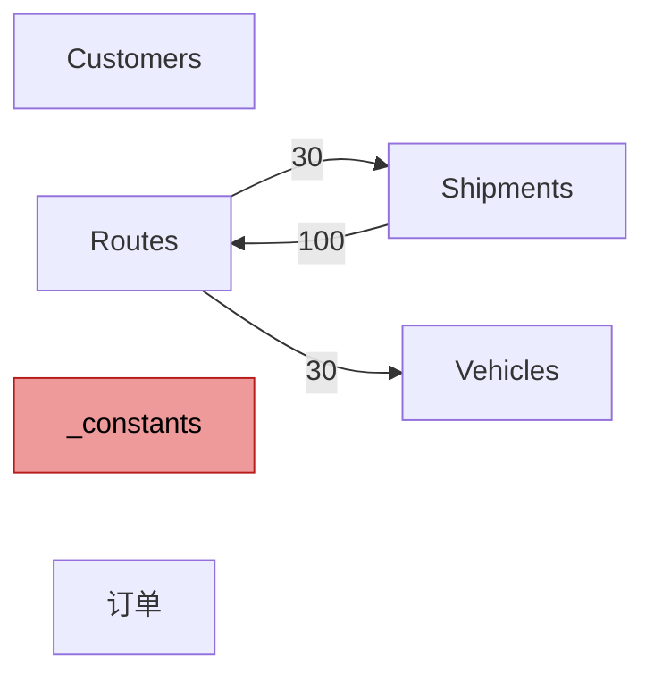
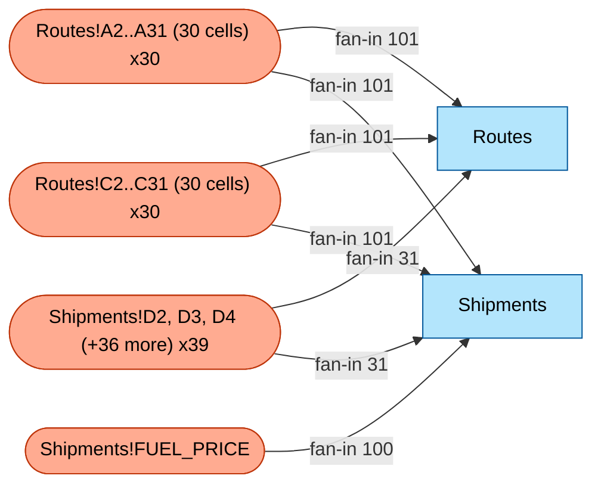

# Audit report — `logistics_routing_synth.xlsm` (audit v0.1.0)

> Headline: complexity **68/100**, **4** pillar cell(s), **99** smell finding(s).
>
> Tier 1 audit. Pure static analysis — no AI, no Excel, no macro execution.
> Same input always produces the same output. Findings ranked, not interpreted.

## Executive Summary

- **Complexity score: 68 / 100** — moderately complex — meaningful refactor effort.
- **Most-referenced cell group**: `Routes!A2..A31 (30 cells)` (30 cells, fan-in 101). Each cell drives 101 calculations.
- **Top smell**: `multiple-references` at `Routes!A10` (metric=101, severity=high).
- **Detected domain**: `logistics-routing` _(confidence: medium, matched: routes, shipments, vehicles_).
- **Operational entry points**: 1 button(s), 0 event handler(s). See Workflow Guide for the walkthrough.
- **Risk flags**: 1 veryHidden sheet(s).

**Complexity sub-scores:**

| Sub-score | Value | Bar |
|---|---|---|
| data scale | 18/20 | `█████████░` |
| formula depth | 0/20 | `░░░░░░░░░░` |
| metadata complexity | 10/20 | `█████░░░░░` |
| smell density | 20/20 | `██████████` |
| vba mass | 20/20 | `██████████` |

## Table of Contents

- [Executive Summary](#executive-summary)
- [Workflow Guide](#workflow-guide)
- [Data Flow Story](#data-flow-story)
- [Top Impact Findings](#top-impact-findings)
- [VBA Module Walkthrough](#vba-module-walkthrough)
- [Domain-Specific Findings](#domain-specific-findings)
- [Reference Appendix](#reference-appendix)
- [Glossary](#glossary)
- [Methodology](#methodology)

## Workflow Guide

_Inferred from the workbook's VBA structure and embedded form-control buttons (no AI). This is how the workbook is operationally used._

_**What this means**: the steps below describe the sequence a user follows — typically: open the workbook, enter inputs, click button(s), read the resulting cells. This is structural inference; semantic narrative (e.g. "this calculates capacity utilization") would require Track B LLM augmentation._

<!-- LLM-AUGMENT: workflow-step:1 -->
Despite the button labeled 'Run Routing Calculation' on the Routes sheet, the bound macro is `backup__001WebClient.cls.Execute` — an HTTP request executor inherited from the VBA-Web donor library, not a routing solver. Clicking this button will attempt an outbound web call (likely 404 or timeout in this workbook's context) rather than recompute route assignments. This is a classic legacy mismatch: the button's label was edited but its bound macro was never repointed to a real routing routine.

## Data Flow Story

_Plain-language description of how data flows between sheets, before the schematic diagram. Derived from formula cross-sheet references and VBA write targets._

_**What this means**: each paragraph below tells you whether a sheet is **input** (user types here), **derived** (populated by formulas or macros), or **mixed** — and where its values come from / go to._

<!-- LLM-AUGMENT: data-flow:Shipments -->
### `Shipments` (visible, 101 rows × 5 cols, 505 non-empty cells)
Shipment-to-route assignment table — each row is one customer order with weight (kg) and a route ID it has been packed onto. Column E computes per-shipment fuel cost via `INDEX(Routes!DistanceKm,MATCH...) * FUEL_PRICE`, so this sheet is a transformation hub: user-edited assignments in columns A-D drive computed cost in E. The 100 outbound references into Routes (capacity utilization SUMIFS) make this the workbook's blast-radius hot spot for any column-D rewrite.

<!-- LLM-AUGMENT: data-flow:Routes -->
### `Routes` (visible, 31 rows × 6 cols, 186 non-empty cells)
Route master table — one row per delivery route (RouteID, AssignedVehicle, DistanceKm, TotalStops, EstimatedTimeHours, CapacityUtilization). The capacity-utilization formula in column F implements a classic VRP feasibility check: `SUMIFS(Shipments.weight, route_id) / VLOOKUP(vehicle, Vehicles, capacity)` — values > 1.0 indicate overpacked routes. This sheet is a derived/computed sheet that depends transitively on Shipments and Vehicles; it is never the source of truth.

<!-- LLM-AUGMENT: data-flow:Customers -->
### `Customers` (visible, 41 rows × 4 cols, 164 non-empty cells)
**Role**: **input sheet** — no formulas, no inbound cross-sheet references, no VBA writes. Likely user-driven manual entry.

<!-- LLM-AUGMENT: data-flow:订单 -->
### `订单` (visible, 21 rows × 6 cols, 126 non-empty cells)
Order header table (Chinese-localized: 订单 = orders). Static input, 0 formulas, 0 consumers in the formula graph. Likely a deprecated or future-staging sheet — its 20 rows look like shipment-level data but are not referenced by the routing math elsewhere. Worth confirming with the original author whether this is an alternate data source, an import staging area, or dead.

<!-- LLM-AUGMENT: data-flow:Vehicles -->
### `Vehicles` (visible, 16 rows × 4 cols, 64 non-empty cells)
**Role**: **computed sheet** — populated by formulas with cross-sheet lookups.
**Consumers** (other sheets reading this one): `Routes` (30).

<!-- LLM-AUGMENT: data-flow:_constants -->
### `_constants` (veryHidden, 7 rows × 5 cols, 35 non-empty cells)
**Role**: **input sheet** — no formulas, no inbound cross-sheet references, no VBA writes. Likely user-driven manual entry.

**Sheet data flow diagram**:

_Cross-sheet formula references. Edge label = number of formulas with cross-sheet refs from source -> target sheet. Yellow = hidden, red = veryHidden._

## Top Impact Findings

_Top-N filtered list across pillars, anomalies, smells, and risks. Full catalogs live in the Reference Appendix (§8)._

### Top-5 Pillar Cells (single-points-of-impact)

| # | Cell / range | Value | Label | Fan-in | Affected sheets |
|---|---|---|---|---|---|
| 1 | `Routes!A2..A31 (30 cells)` | `R001` | col header `RouteID` | 101 | `Routes`, `Shipments` |
| 2 | `Routes!C2..C31 (30 cells)` | `148` | row label `R001`; col header `DistanceKm` | 101 | `Routes`, `Shipments` |
| 3 | `Shipments!FUEL_PRICE` | _(empty)_ | — | 100 | `Shipments` |
| 4 | `Shipments!D2, D3, D4 (+36 more)` | `R013` | row label `O00001`; col header `AssignedRoute` | 31 | `Routes`, `Shipments` |

_See §8.1 for the full pillar table; each row's narrative explains the cell's role and impact._

### Top-5 Magic-number Anomalies (cluster outliers)

_No magic-number anomalies detected. Either no large duplicated-formula clusters, or every cluster's numbers are perfectly consistent._

### Top-5 Smell Findings

_**What this means**: code-smell categories from Hermans 2015. Not bugs — patterns that often indicate maintainability risk._

| # | Type | Location | Metric | Severity | Evidence |
|---|---|---|---|---|---|
| 1 | `multiple-references` | `Routes!A10` | 101 | high | referenced by 101 distinct formulas |
| 2 | `duplicated-formulas` | `pattern@Shipments!E2` | 100 | high | 100 cells share this normalized formula pattern; sample: =IFERROR(INDEX(Routes!$C$2:$C$31,MATCH(D2,Routes!$A$2:$A$31,0))*FUEL_PRICE,0) |
| 3 | `duplicated-formulas` | `pattern@Routes!E2` | 30 | medium | 30 cells share this normalized formula pattern; sample: =C2/SPEED_KMH+D2*SERVICE_TIME_MIN/60 |
| 4 | `duplicated-formulas` | `pattern@Vehicles!D2` | 15 | low | 15 cells share this normalized formula pattern; sample: =FUEL_PRICE*0.439 |
| 5 | `magic-numbers` | `Routes!E10` | 1 | low | 1 non-trivial numeric literal(s): 60 |

_Full smell catalog: §8.2._

### Top Risk Indicators

- **1 veryHidden sheet(s)**: `_constants` — invisible in Excel UI even via Hide/Unhide menu; only VBA reveals them.

## VBA Module Walkthrough

_Per-module heuristic narrative, ordered by call-graph dependency from user-callable entry points (button-bound + event handlers). **This is structural narration, not semantic** — we report what reads/writes and what calls what, but not what the code MEANS for the business (that's Track B / LLM augmentation)._

_**What this means**: each module gets a 4-line summary: structural role, what it does (sheets it reads/writes, modules it calls), notable patterns (error handling, magic numbers, loops), and call relationships._

<!-- LLM-AUGMENT: vba-narration:backup__001WebClient.cls -->
### `backup__001WebClient.cls` (data-loader, 757 lines)
HTTP client implementation inherited verbatim from the public VBA-Web library (vba-tools/VBA-Web). It executes requests via WinHttpRequest with retry/timeout logic and parses response JSON/XML. **Unrelated to the workbook's logistics-routing theme** — this is donor code that came along when the original author copied VBA-Web wholesale. The fact that the 'Run Routing Calculation' button is bound to this module's `Execute` Sub is almost certainly an authoring error; clicking the button has no business effect.

<!-- LLM-AUGMENT: vba-narration:backup__000WebHelpers.bas -->
### `backup__000WebHelpers.bas` (data-loader, 3177 lines)

**Role inference**: large multi-purpose module — likely the workbook's main logic block.
**What it does (structural)**: calls into modules `Dictionary.cls`, `backup__001WebClient.cls`, `backup__002WebRequest.cls`; contains 2 levels of nested loops.
**Notable patterns**:
- Contains `On Error Resume Next` at line(s) 2129, 2317 — silent failure risk; errors are suppressed silently.
- Uses external/COM API keyword(s): `Application.Run`, `CreateObject`, `Shell`.
**Call relationships**: called by `DigestAuthenticator.cls`, `FacebookAuthenticator.cls`, `GoogleAuthenticator.cls` (+12 more); calls `Dictionary.cls`, `backup__001WebClient.cls`, `backup__002WebRequest.cls`.

<!-- LLM-AUGMENT: vba-narration:backup__002WebRequest.cls -->
### `backup__002WebRequest.cls` (mixed, 874 lines)

**Role inference**: large multi-purpose module — likely the workbook's main logic block.
**What it does (structural)**: calls into modules `Dictionary.cls`, `backup__000WebHelpers.bas`, `backup__001WebClient.cls`.
**Call relationships**: called by `Analytics.bas`, `Maps.bas`, `WebClient.cls` (+4 more); calls `Dictionary.cls`, `backup__000WebHelpers.bas`, `backup__001WebClient.cls`.

<!-- LLM-AUGMENT: vba-narration:Dictionary.cls -->
### `Dictionary.cls` (mixed, 458 lines)

**Role inference**: mixed responsibilities — no single structural signal dominates.
**What it does (structural)**: calls into modules `backup__001WebClient.cls`.
**Notable patterns**:
- Contains `On Error Resume Next` at line(s) 259 — silent failure risk; errors are suppressed silently.
- Uses external/COM API keyword(s): `CreateObject`, `GetObject`.
**Call relationships**: called by `Credentials.bas`, `Salesforce.bas`, `TodoistAuthenticator.cls` (+4 more); calls `backup__001WebClient.cls`.

### Possibly dead code (36 module(s))

_The following modules are not reached from any detected button or event handler. They may be legacy code, helper libraries pulled in but unused, or detection misses (ActiveX controls, dynamic VBA calls). Audit before deleting._

<!-- LLM-AUGMENT: vba-narration:Analytics.bas -->
- `Analytics.bas` (mixed, 62 lines, 1 subs/funcs)
<!-- LLM-AUGMENT: vba-narration:AnalyticsSheet.cls -->
- `AnalyticsSheet.cls` (report-writer, 31 lines, 2 subs/funcs)
<!-- LLM-AUGMENT: vba-narration:backup__003WebResponse.cls -->
- `backup__003WebResponse.cls` (transformer, 408 lines, 13 subs/funcs)
<!-- LLM-AUGMENT: vba-narration:backup__004IWebAuthenticator.cls -->
- `backup__004IWebAuthenticator.cls` (dead-suspected, 70 lines, 4 subs/funcs)
<!-- LLM-AUGMENT: vba-narration:Credentials.bas -->
- `Credentials.bas` (data-loader, 74 lines, 1 subs/funcs)
<!-- LLM-AUGMENT: vba-narration:DigestAuthenticator.cls -->
- `DigestAuthenticator.cls` (mixed, 245 lines, 11 subs/funcs)
<!-- LLM-AUGMENT: vba-narration:EmptyAuthenticator.cls -->
- `EmptyAuthenticator.cls` (dead-suspected, 75 lines, 5 subs/funcs)
<!-- LLM-AUGMENT: vba-narration:Facebook.bas -->
- `Facebook.bas` (dead-suspected, 30 lines, 1 subs/funcs)
- _(+28 more — see §8.7.)_

## Domain-Specific Findings

_Detected domain templates (e.g. manufacturing/capacity-planning, logistics/routing). For each, we cross-checked the workbook against industry-known hardcoded-risk constants and scheduling-method hallmarks._

_**What this means**: domain templates pre-populate "things to look for" specific to a vertical. They're a heuristic checklist, not a verdict — every hit deserves a closer look but isn't necessarily a bug._

<!-- LLM-AUGMENT: domain-method:logistics-routing -->
### Logistics — Vehicle Routing  _(confidence: high)_
The workbook detects as logistics-routing via keyword hits (Routes/Vehicles/Shipments) but implements only the simplest decision support: per-route capacity utilization (SUMIFS / capacity) and per-shipment fuel cost. **No actual routing optimization is present** — there is no Clarke-Wright savings algorithm, no nearest-neighbor heuristic, no time-window feasibility check, no Solver invocation. The workbook is therefore a routing **report generator**, not a routing **planner**. If decisions are being made elsewhere (manual planner spreadsheet, third-party TMS), this workbook merely visualizes the result.

## Reference Appendix

_Full data tables and indices. Every catalog the audit produces lives below — for technical readers verifying findings or following up on a Top Impact entry._

### 8.1 Full pillar table

_Full deduped pillar list — see Top Impact §5 for the Top-5 view._

| Rank | Cell / range | Value | Label | Members | Fan-in | Affected sheets | Kind | Narrative |
|---|---|---|---|---|---|---|---|---|
| 1 | `Routes!A2..A31 (30 cells)` | `R001` | col header `RouteID` | 30 | 101 | `Routes`, `Shipments` | column-block | 30 cells in this column block (value `R001`, label `RouteID`) each cascade into 101 formulas across sheets `Routes`, `Shipments` — modifying the column header or any single cell propagates similarly (very-high cumulative blast radius). |
| 2 | `Routes!C2..C31 (30 cells)` | `148` | row label `R001`; col header `DistanceKm` | 30 | 101 | `Routes`, `Shipments` | column-block | 30 cells in this column block (value `148`, label `R001`) each cascade into 101 formulas across sheets `Routes`, `Shipments` — modifying the column header or any single cell propagates similarly (very-high cumulative blast radius). |
| 3 | `Shipments!FUEL_PRICE` | _(empty)_ | — | 1 | 100 | `Shipments` | constant-input | Modifying `Shipments!FUEL_PRICE` (a constant input) would cascade into 100 formulas across sheet `Shipments` — very-high-risk change point. |
| 4 | `Shipments!D2, D3, D4 (+36 more)` | `R013` | row label `O00001`; col header `AssignedRoute` | 39 | 31 | `Routes`, `Shipments` | column-block | 39 cells in this column block (value `R013`, label `O00001`) each cascade into 31 formulas across sheets `Routes`, `Shipments` — modifying the column header or any single cell propagates similarly (notable cumulative blast radius). |

### 8.2 Full smells catalog (Hermans 2015)

_99 smell finding(s) across 3 smell type(s)._

#### `multiple-references` — 50 finding(s)

| Location | Metric | Severity | Confidence | Evidence |
|---|---|---|---|---|
| `Routes!A10` | 101 | high | high | referenced by 101 distinct formulas |
| `Routes!A11` | 101 | high | high | referenced by 101 distinct formulas |
| `Routes!A12` | 101 | high | high | referenced by 101 distinct formulas |
| `Routes!A13` | 101 | high | high | referenced by 101 distinct formulas |
| `Routes!A14` | 101 | high | high | referenced by 101 distinct formulas |
| `Routes!A15` | 101 | high | high | referenced by 101 distinct formulas |
| `Routes!A16` | 101 | high | high | referenced by 101 distinct formulas |
| `Routes!A17` | 101 | high | high | referenced by 101 distinct formulas |
| `Routes!A18` | 101 | high | high | referenced by 101 distinct formulas |
| `Routes!A19` | 101 | high | high | referenced by 101 distinct formulas |
| `Routes!A2` | 101 | high | high | referenced by 101 distinct formulas |
| `Routes!A20` | 101 | high | high | referenced by 101 distinct formulas |
| `Routes!A21` | 101 | high | high | referenced by 101 distinct formulas |
| `Routes!A22` | 101 | high | high | referenced by 101 distinct formulas |
| `Routes!A23` | 101 | high | high | referenced by 101 distinct formulas |
| `Routes!A24` | 101 | high | high | referenced by 101 distinct formulas |
| `Routes!A25` | 101 | high | high | referenced by 101 distinct formulas |
| `Routes!A26` | 101 | high | high | referenced by 101 distinct formulas |
| `Routes!A27` | 101 | high | high | referenced by 101 distinct formulas |
| `Routes!A28` | 101 | high | high | referenced by 101 distinct formulas |

_(30 more findings of this type — see `audit.json`.)_

#### `long-calculation-chain` — 0 finding(s)

_No findings above threshold._

#### `conditional-complexity` — 0 finding(s)

_No findings above threshold._

#### `multiple-operations` — 0 finding(s)

_No findings above threshold._

#### `magic-numbers` — 45 finding(s)

| Location | Metric | Severity | Confidence | Evidence |
|---|---|---|---|---|
| `Routes!E10` | 1 | low | medium | 1 non-trivial numeric literal(s): 60 |
| `Routes!E11` | 1 | low | medium | 1 non-trivial numeric literal(s): 60 |
| `Routes!E12` | 1 | low | medium | 1 non-trivial numeric literal(s): 60 |
| `Routes!E13` | 1 | low | medium | 1 non-trivial numeric literal(s): 60 |
| `Routes!E14` | 1 | low | medium | 1 non-trivial numeric literal(s): 60 |
| `Routes!E15` | 1 | low | medium | 1 non-trivial numeric literal(s): 60 |
| `Routes!E16` | 1 | low | medium | 1 non-trivial numeric literal(s): 60 |
| `Routes!E17` | 1 | low | medium | 1 non-trivial numeric literal(s): 60 |
| `Routes!E18` | 1 | low | medium | 1 non-trivial numeric literal(s): 60 |
| `Routes!E19` | 1 | low | medium | 1 non-trivial numeric literal(s): 60 |
| `Routes!E2` | 1 | low | medium | 1 non-trivial numeric literal(s): 60 |
| `Routes!E20` | 1 | low | medium | 1 non-trivial numeric literal(s): 60 |
| `Routes!E21` | 1 | low | medium | 1 non-trivial numeric literal(s): 60 |
| `Routes!E22` | 1 | low | medium | 1 non-trivial numeric literal(s): 60 |
| `Routes!E23` | 1 | low | medium | 1 non-trivial numeric literal(s): 60 |
| `Routes!E24` | 1 | low | medium | 1 non-trivial numeric literal(s): 60 |
| `Routes!E25` | 1 | low | medium | 1 non-trivial numeric literal(s): 60 |
| `Routes!E26` | 1 | low | medium | 1 non-trivial numeric literal(s): 60 |
| `Routes!E27` | 1 | low | medium | 1 non-trivial numeric literal(s): 60 |
| `Routes!E28` | 1 | low | medium | 1 non-trivial numeric literal(s): 60 |

_(25 more findings of this type — see `audit.json`.)_

#### `duplicated-formulas` — 4 finding(s)

| Location | Metric | Severity | Confidence | Evidence |
|---|---|---|---|---|
| `pattern@Shipments!E2` | 100 | high | medium | 100 cells share this normalized formula pattern; sample: =IFERROR(INDEX(Routes!$C$2:$C$31,MATCH(D2,Routes!$A$2:$A$31,0))*FUEL_PRICE,0) |
| `pattern@Routes!E2` | 30 | medium | medium | 30 cells share this normalized formula pattern; sample: =C2/SPEED_KMH+D2*SERVICE_TIME_MIN/60 |
| `pattern@Routes!F2` | 30 | medium | medium | 30 cells share this normalized formula pattern; sample: =SUMIFS(Shipments!$C$2:$C$101,Shipments!$D$2:$D$101,A2)/IFERROR(VLOOKUP(B2,Vehic |
| `pattern@Vehicles!D2` | 15 | low | medium | 15 cells share this normalized formula pattern; sample: =FUEL_PRICE*0.439 |

### 8.3 Sheets

| Sheet | State | Rows | Cols | Non-empty | Formula | Max ref | CF | DV |
|---|---|---|---|---|---|---|---|---|
| `Customers` | visible | 41 | 4 | 164 | 0 | D41 | 0 | 0 |
| `Routes` | visible | 31 | 6 | 186 | 60 | F31 | 1 | 0 |
| `Shipments` | visible | 101 | 5 | 505 | 100 | E101 | 0 | 0 |
| `Vehicles` | visible | 16 | 4 | 64 | 15 | D16 | 0 | 0 |
| `_constants` | veryHidden | 7 | 5 | 35 | 0 | E7 | 0 | 0 |
| `订单` | visible | 21 | 6 | 126 | 0 | F21 | 0 | 0 |

### 8.4 Named ranges

| Name | Scope | Reference |
|---|---|---|
| `DRIVER_SHIFT_HOURS` | `workbook` | `_constants!$C$7` |
| `FUEL_PRICE` | `workbook` | `_constants!$C$6` |
| `MAX_STOPS_PER_ROUTE` | `workbook` | `_constants!$C$5` |
| `MAX_VEHICLES` | `workbook` | `_constants!$C$2` |
| `SERVICE_TIME_MIN` | `workbook` | `_constants!$C$4` |
| `SPEED_KMH` | `workbook` | `_constants!$C$3` |

### 8.5 Magic-number index (top 20)

| Value | Count | First location | Source | Sample context |
|---|---|---|---|---|
| `4` | 34 | `<vba>` | vba | `auth_Parameters(UBound(auth_Parameters) - 4) = "oauth_nonce=" & auth_Nonce` |
| `60` | 32 | `Routes!E2` | cell | `=C2/SPEED_KMH+D2*SERVICE_TIME_MIN/60` |
| `3` | 23 | `<vba>` | vba | `auth_Parameters(UBound(auth_Parameters) - 3) = "oauth_signature_method=" & auth_SignatureMethod` |
| `11041` | 20 | `<vba>` | vba | `Err.Raise 11041 + vbObjectError, _` |
| `11040` | 19 | `<vba>` | vba | `Err.Raise 11040 + vbObjectError, "OAuthDialog", "Login was cancelled"` |
| `5` | 17 | `<vba>` | vba | `auth_Parameters(UBound(auth_Parameters) - 5) = "oauth_consumer_key=" & Me.ConsumerKey` |
| `10001` | 12 | `<vba>` | vba | `Err.Raise 10001, "JSONConverter", json_ParseErrorMessage(JsonString, json_Index, "Expecting '{' or '['")` |
| `12` | 10 | `<vba>` | vba | `web_WinHttpRequestOption_EnableHttpsToHttpRedirects = 12` |
| `11099` | 9 | `<vba>` | vba | `LogError web_ErrorMsg, "WebHelpers.ParseXml", 11099` |
| `46` | 8 | `<vba>` | vba | `Case 33, 35, 36, 38, 39, 42, 43, 45, 46, 94, 95, 96, 124, 126` |
| `47` | 8 | `<vba>` | vba | `Case 47` |
| `6` | 8 | `<vba>` | vba | `ReDim Preserve auth_Parameters(UBound(auth_Parameters) + 6)` |
| `13` | 7 | `<vba>` | vba | `web_WinHttpRequestOption_EnablePassportAuthentication = 13` |
| `7` | 7 | `<vba>` | vba | `web_WinHttpRequestOption_UrlEscapeDisable = 7` |
| `8` | 7 | `<vba>` | vba | `web_WinHttpRequestOption_UrlEscapeDisableQuery = 8` |
| `15` | 6 | `<vba>` | vba | `Case 0 To 15` |
| `16` | 6 | `<vba>` | vba | `web_WinHttpRequestOption_MaxResponseDrainSize = 16` |
| `31` | 6 | `<vba>` | vba | `utc_StandardName(0 To 31) As Integer` |
| `45` | 6 | `<vba>` | vba | `Case 33, 35, 36, 38, 39, 42, 43, 45, 46, 94, 95, 96, 124, 126` |
| `48` | 6 | `<vba>` | vba | `Case 48 To 57` |

### 8.6 Risk indicators

| Indicator | Value |
|---|---|
| Hidden sheets | 0 (`—`) |
| Very-hidden sheets | 1 (`_constants`) |
| Cross-sheet referencing formulas | 130 |
| Cells with formula errors (cached) | 0 |
| External workbook reference patterns | 0 |
| Circular reference suspects | 0 |
| Parse errors logged | 0 |

### 8.7 Complexity score breakdown

**Total: 68 / 100**

| Sub-score | Value | Bar | Rationale |
|---|---|---|---|
| data scale | 18/20 | `█████████░` | log10(1080) cells -> 18/20 |
| formula depth | 0/20 | `░░░░░░░░░░` | max-cond=0, max-ops=0, max-chain=0 -> 0/20 |
| metadata complexity | 10/20 | `█████░░░░░` | 0 hidden + 1 veryHidden + 6 named ranges + 130 cross-sheet refs -> 10/20 |
| smell density | 20/20 | `██████████` | 99 smells / 1080 cells -> 20/20 |
| vba mass | 20/20 | `██████████` | 14709 LOC across 40 modules -> 20/20 |

### VBA classification overview

| Type | Count | Total LOC | Sample modules |
|---|---|---|---|
| `data-loader` | 18 | 10,436 | `backup__000WebHelpers.bas`, `backup__001WebClient.cls`, `Credentials.bas` (+15 more) |
| `transformer` | 3 | 941 | `backup__003WebResponse.cls`, `Salesforce.bas`, `WebResponse.cls` |
| `report-writer` | 5 | 292 | `AnalyticsSheet.cls`, `MapsSheet.cls`, `OPSSheet.cls` (+2 more) |
| `dead-suspected` | 8 | 432 | `backup__004IWebAuthenticator.cls`, `EmptyAuthenticator.cls`, `Facebook.bas` (+5 more) |
| `mixed` | 6 | 2,608 | `Analytics.bas`, `backup__002WebRequest.cls`, `Dictionary.cls` (+3 more) |

**Classification mini-diagram (top 2 categories, ≤ 15 nodes):**

```mermaid
graph TB
data_loader[["data-loader (18)"]]
dead_suspected[["dead-suspected (8)"]]
backup__000WebHelpers_bas["backup__000WebHelpers.bas"]
backup__001WebClient_cls["backup__001WebClient.cls"]
Credentials_bas["Credentials.bas"]
FacebookAuthenticator_cls["FacebookAuthenticator.cls"]
Gmail_bas["Gmail.bas"]
GoogleAuthenticator_cls["GoogleAuthenticator.cls"]
LinkedIn_bas["LinkedIn.bas"]
LinkedInSheet_cls["LinkedInSheet.cls"]
backup__004IWebAuthenticator_cls["backup__004IWebAuthenticator.cls"]
EmptyAuthenticator_cls["EmptyAuthenticator.cls"]
Facebook_bas["Facebook.bas"]
data_loader --> backup__000WebHelpers_bas
data_loader --> backup__001WebClient_cls
data_loader --> Credentials_bas
data_loader --> FacebookAuthenticator_cls
data_loader --> Gmail_bas
data_loader --> GoogleAuthenticator_cls
data_loader --> LinkedIn_bas
data_loader --> LinkedInSheet_cls
more_data_loader["+ 10 more"]
data_loader --> more_data_loader
dead_suspected --> backup__004IWebAuthenticator_cls
dead_suspected --> EmptyAuthenticator_cls
dead_suspected --> Facebook_bas
more_dead_suspected["+ 5 more"]
dead_suspected --> more_dead_suspected
classDef cls_data_loader fill:#90caf9,stroke:#333333,color:#000000;
class data_loader cls_data_loader
classDef cls_dead_suspected fill:#bdbdbd,stroke:#333333,color:#000000;
class dead_suspected cls_dead_suspected
```

#### VBA modules — full table

| Module | Type | LOC | #Sub | #Func | Inferred type | Confidence | Reads | Writes | Ext calls | OnErrorResumeNext |
|---|---|---|---|---|---|---|---|---|---|---|
| `Analytics.bas` | standard | 62 | 0 | 1 | **mixed** | low | — | — | no | no |
| `AnalyticsSheet.cls` | class_or_document | 31 | 2 | 0 | **report-writer** | low | — | — | no | no |
| `backup__000WebHelpers.bas` | standard | 3177 | 11 | 53 | **data-loader** | medium | — | — | yes | yes |
| `backup__001WebClient.cls` | class_or_document | 757 | 4 | 7 | **data-loader** | medium | — | — | yes | no |
| `backup__002WebRequest.cls` | class_or_document | 874 | 9 | 2 | **mixed** | low | — | — | no | no |
| `backup__003WebResponse.cls` | class_or_document | 408 | 5 | 8 | **transformer** | low | — | — | yes | yes |
| `backup__004IWebAuthenticator.cls` | class_or_document | 70 | 4 | 0 | **dead-suspected** | medium | — | — | yes | no |
| `Credentials.bas` | standard | 74 | 0 | 1 | **data-loader** | high | — | — | no | no |
| `Dictionary.cls` | class_or_document | 458 | 9 | 7 | **mixed** | low | — | — | yes | yes |
| `DigestAuthenticator.cls` | class_or_document | 245 | 6 | 5 | **mixed** | low | — | — | yes | no |
| `EmptyAuthenticator.cls` | class_or_document | 75 | 5 | 0 | **dead-suspected** | medium | — | — | yes | no |
| `Facebook.bas` | standard | 30 | 1 | 0 | **dead-suspected** | medium | — | — | no | no |
| `FacebookAuthenticator.cls` | class_or_document | 415 | 9 | 8 | **data-loader** | high | — | — | yes | no |
| `Gmail.bas` | standard | 87 | 1 | 2 | **data-loader** | high | — | — | no | no |
| `GoogleAuthenticator.cls` | class_or_document | 436 | 9 | 8 | **data-loader** | high | — | — | yes | no |
| `HttpBasicAuthenticator.cls` | class_or_document | 95 | 5 | 0 | **mixed** | low | — | — | yes | no |
| `IWebAuthenticator.cls` | class_or_document | 70 | 4 | 0 | **dead-suspected** | medium | — | — | yes | no |
| `LinkedIn.bas` | standard | 82 | 0 | 1 | **data-loader** | low | — | — | no | no |
| `LinkedInSheet.cls` | class_or_document | 25 | 2 | 0 | **data-loader** | high | — | — | no | no |
| `Maps.bas` | standard | 97 | 1 | 3 | **data-loader** | low | — | — | no | no |
| `MapsSheet.cls` | class_or_document | 39 | 2 | 0 | **report-writer** | low | — | — | no | no |
| `OAuth1Authenticator.cls` | class_or_document | 298 | 5 | 8 | **data-loader** | high | — | — | yes | no |
| `OAuth2Authenticator.cls` | class_or_document | 174 | 6 | 1 | **data-loader** | low | — | — | yes | no |
| `OPS.bas` | standard | 177 | 0 | 8 | **data-loader** | high | — | — | yes | no |
| `OPSAuthenticator.cls` | class_or_document | 118 | 5 | 1 | **data-loader** | low | — | — | yes | no |
| `OPSSheet.cls` | class_or_document | 55 | 3 | 0 | **report-writer** | low | — | — | no | no |
| `Salesforce.bas` | standard | 125 | 0 | 7 | **transformer** | medium | — | — | no | no |
| `SalesforceSheet.cls` | class_or_document | 101 | 6 | 0 | **report-writer** | medium | — | — | yes | no |
| `ThisWorkbook.cls` | class_or_document | 8 | 0 | 0 | **dead-suspected** | medium | — | — | no | no |
| `Todoist.bas` | standard | 34 | 1 | 0 | **data-loader** | low | — | — | no | no |
| `TodoistAuthenticator.cls` | class_or_document | 388 | 7 | 8 | **data-loader** | high | — | — | yes | no |
| `Translate.bas` | standard | 32 | 1 | 1 | **dead-suspected** | medium | — | — | no | no |
| `Twitter.bas` | standard | 68 | 0 | 2 | **dead-suspected** | medium | — | — | no | no |
| `TwitterAuthenticator.cls` | class_or_document | 163 | 5 | 1 | **data-loader** | low | — | — | yes | no |
| `TwitterSheet.cls` | class_or_document | 66 | 5 | 0 | **report-writer** | medium | — | — | no | no |
| `WebClient.cls` | class_or_document | 757 | 4 | 7 | **data-loader** | medium | — | — | yes | no |
| `WebHelpers.bas` | standard | 3177 | 11 | 53 | **data-loader** | medium | — | — | yes | yes |
| `WebRequest.cls` | class_or_document | 874 | 9 | 2 | **mixed** | low | — | — | no | no |
| `WebResponse.cls` | class_or_document | 408 | 5 | 8 | **transformer** | low | — | — | yes | yes |
| `WindowsAuthenticator.cls` | class_or_document | 79 | 4 | 0 | **dead-suspected** | medium | — | — | yes | no |

### Pillar impact diagram

_Top-5 pillar cells and the sheets they cascade into._

### 8.10 File metadata

| Field | Value |
|---|---|
| File name | `logistics_routing_synth.xlsm` |
| File size | 437,348 bytes (427.1 KB) |
| SHA-256 | `c6ed65095fcb739caaf21facc9553a95801de16d7500ec9948f2ccf3b1768f50` |

### 8.11 Basic statistics

| Metric | Value |
|---|---|
| Sheet count (total) | 6 |
| Sheet count visible / hidden / veryHidden | 5 / 0 / 1 |
| Non-empty cells | 1,080 |
| Formula cells | 175 |
| Unique non-formula values | 475 |
| Named ranges | 6 |
| Conditional formatting rules | 1 |
| Data validation rules | 0 |
| VBA modules | 40 |
| VBA total lines | 14,709 |
| Cell-level parse errors (logged + skipped) | 0 |

## Glossary

_Plain-language definitions for terms used throughout this report. Alphabetical._

- **anomaly (magic-number)** — Inside a cluster of cells sharing the same formula shape, a position where a small minority uses a different numeric constant. Often signals a missed update or undocumented carve-out.
- **audit** — The full report this tool produces — markdown + JSON + HTML — for one xlsm workbook. Pure static analysis, zero LLM, zero network.
- **BYOA (Bring Your Own AI)** — Distribution model where the customer uses their own LLM subscription. We do not call any LLM; we just package context for them to paste into Copilot / Claude / etc.
- **column-block (pillar)** — When N cells in the same column share the same fan-in count and the same set of dependent sheets, we collapse them into one pillar entry with `member_count = N` instead of N separate rows.
- **complexity score** — A 0-100 composite of 5 sub-scores (data scale, formula depth, metadata complexity, smell density, VBA mass). Higher = harder to refactor.
- **confidence (high/medium/low)** — How certain we are about a finding. `high` = exact deterministic count; `medium` = tokenizer-based with well-defined rules; `low` = statistical inference or analysis skipped.
- **data-loader / transformer / report-writer / ui-handler** — VBA module classifications based on Sub/Function naming patterns (`Load*`, `Calc*`, `Print*`, `*_Click`) and structural counts (reads/writes/loops). Heuristic only.
- **dead-suspected (VBA)** — A module with no Sub calls, no value writes, no name signals — likely empty or unused. May still be reachable through dynamic VBA calls; verify before deleting.
- **domain** — An industry vertical we detected via keyword matching: capacity-planning / inventory-supply-chain / logistics-routing / operations-s&op / actuarial-insurance / financial-modeling. Triggers domain-specific sections when matched.
- **duplicated-formulas** — Cells whose normalized formula pattern appears in many places. Often legitimate (column-fill), but can hide outliers — see Magic-number Anomalies.
- **fan-in** — How many distinct formulas reference a given cell. Higher fan-in = modifying that cell ripples through more calculations.
- **formula relay (pillar)** — A pillar cell that itself is a formula — others read its result, and it is itself derived. Modifying the formula changes downstream derivations.
- **Hermans smells** — Spreadsheet code-smell catalog from Felienne Hermans's 2015 paper (multiple-references, conditional-complexity, multiple-operations, duplicated-formulas, magic-numbers, long-calculation-chain).
- **incoming / outgoing (cell)** — Cell A's `incoming` set is every cell whose formula reads A. Cell A's `outgoing` set is every cell A's formula reads. Together they form the cell-level dataflow graph.
- **LLM-AUGMENT marker** — An HTML comment like `<!-- LLM-AUGMENT: vba-narration:Module1 -->` marking a section a future Track B (LLM) ingest step can replace with richer prose. Invisible in rendered Markdown.
- **magic number** — A non-trivial numeric literal (not 0/1/2/10/100/-1) embedded directly in formula or VBA code. Usually a candidate for extraction into a named constant.
- **On Error Resume Next** — VBA directive that silently skips the next failing line. Risky pattern: errors are suppressed, code keeps running with potentially-bad state. Always reviewed in the audit.
- **pillar cell** — A cell with high fan-in (≥ 20 by default) — modifying it cascades to many formulas. The audit's primary diagnostic for "what should I never accidentally change?"
- **Sanitize mode** — Optional `--sanitize` flag that replaces every non-formula cell value with `<redacted>` before any analysis. Formulas, VBA structure, and counts are preserved. Designed for sharing the audit without leaking the workbook's data.
- **smell** — A code pattern the audit flags as worth a second look. Not a bug — a heuristic 'smelly' indicator borrowed from software engineering.
- **tier (1/1.5/2/3/4/5)** — Our product tiers — Tier 1 = this audit (free, zero-LLM); Tier 1.5 = LLM-assisted comprehension (BYOA); Tier 2 = exec risk report; Tier 3 = refactored Python prototype; etc.
- **Track A / Track B** — Two-track architecture for Tier 1 reports. Track A is fully static (no LLM); Track B is BYOA — tool produces a dossier + mega-prompt the user pastes into their own Copilot / Claude, then pastes the response back.
- **veryHidden sheet** — Excel hides three states: visible / hidden / veryHidden. veryHidden cannot be unhidden through the right-click menu — only VBA can reveal it. Often used for internal config or audit-trail data the user shouldn't touch.
- **workflow step** — One operational step a user performs — typically clicking a button or triggering an event handler. Derived from xl/drawings + VBA static analysis, then topologically sorted by sheet write/read dependency.

## Methodology

- Engine: `openpyxl` 3.1.5 (cells/structure), `oletools.olevba` unknown (VBA), `formulas` 1.3.4 (tokenizer only — no evaluator).
- Smell thresholds: multiple-references ≥ 5; long-calculation-chain depth ≥ 5; conditional-complexity nesting ≥ 2; multiple-operations ≥ 8; duplicated-formulas pattern frequency ≥ 5.
- Logic-depth thresholds: pillar fan-in ≥ 20 (top 10 after dedupe); anomaly cluster size ≥ 5, outlier fraction ≤ 0.05.
- Pillar dedupe: cells in the same column with identical fan-in and identical affected-sheet set are collapsed into one column-block entry. After dedupe we surface the top 10 distinct entries.
- VBA classifier categories: `data-loader`, `transformer`, `report-writer`, `ui-handler`, `dead-suspected`, `mixed`.
- Confidence semantics: `high` = exact / deterministic count; `medium` = tokenizer-based with well-defined rules; `low` = statistical inference or analysis skipped due to scale.
- Domain hint detector: pure keyword matching (case-insensitive, word-boundary) against sheet names, named ranges, and VBA Sub/Function names. No LLM, no inference.
- Trivial numbers excluded from magic-number index: `-1`, `0`, `0.0`, `0.5`, `1`, `1.0`, `10`, `100`, `2`.
- Reliability contract: same input → byte-identical `audit.md`, `audit.json`, and `audit.html`. All outputs use sorted dict keys and lexicographic list ordering. No timestamps. No CDN fetch at audit time.

---

_End of report._
