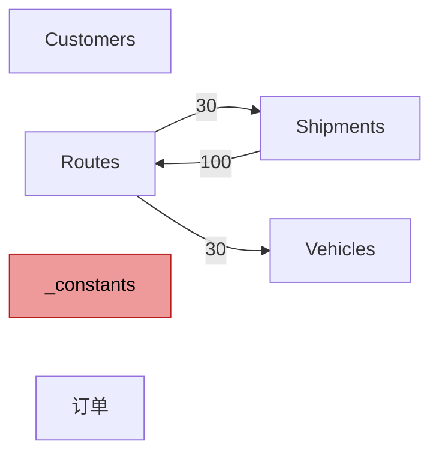
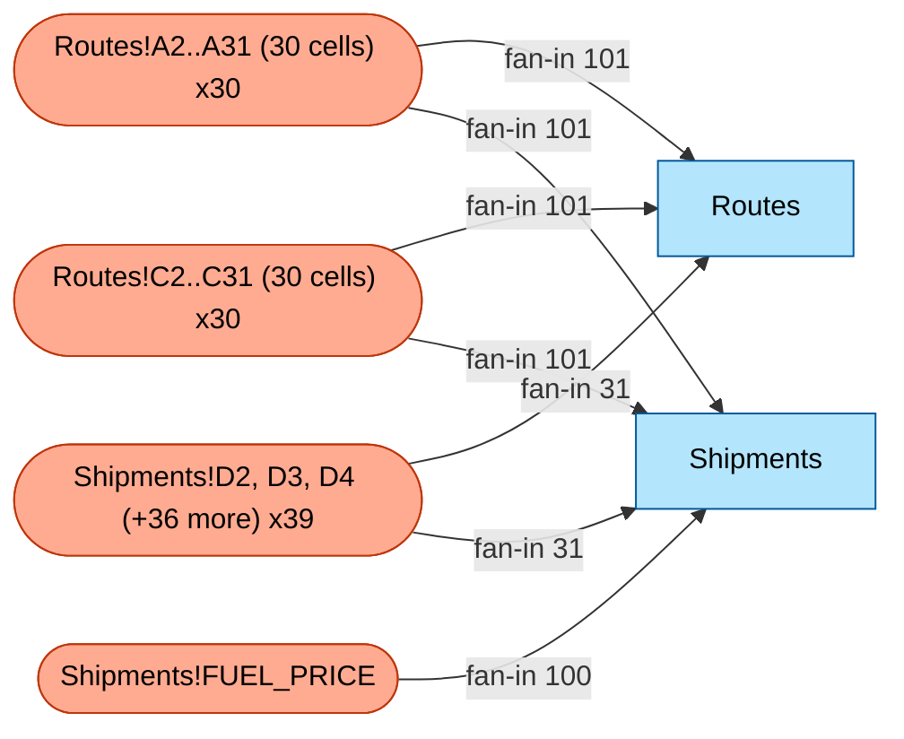

# 审计报告 — `logistics_routing_synth.xlsm` (审计 v0.1.0)

> 概览:复杂度 **68/100**,**4** 个支柱单元格,**99** 个代码异味发现。
>
> Tier 1 审计。纯静态分析 — 无 AI、无 Excel、无宏执行。
> 同样的输入始终产生同样的输出。仅按重要性排序,不做语义解读。

## 执行摘要

- **复杂度评分:68 / 100** — 中等复杂 — 需要明显的重构投入。
- **被引用最多的单元格组**:`Routes!A2..A31 (30 cells)` (30 个单元格,引用数 101)。每个单元格驱动 101 项计算。
- **首要代码异味**:`multiple-references` 位于 `Routes!A10`(指标=101,严重度=high)。
- **检测到的领域**:`logistics-routing` _(置信度:medium,匹配:routes, shipments, vehicles_)。
- **操作入口**:1 个按钮,0 个事件处理器。详见工作流指南。
- **风险标志**:1 个深度隐藏工作表。

**复杂度分项评分:**

| 分项 | 值 | 进度条 |
|---|---|---|
| data scale | 18/20 | `█████████░` |
| formula depth | 0/20 | `░░░░░░░░░░` |
| metadata complexity | 10/20 | `█████░░░░░` |
| smell density | 20/20 | `██████████` |
| vba mass | 20/20 | `██████████` |

## 目录

- [执行摘要](#executive-summary)
- [工作流指南](#workflow-guide)
- [数据流叙事](#data-flow-story)
- [重要影响发现](#top-impact-findings)
- [VBA 模块走查](#vba-module-walkthrough)
- [领域专属发现](#domain-specific-findings)
- [参考附录](#reference-appendix)
- [术语表](#glossary)
- [方法论](#methodology)

## 工作流指南

_由工作簿的 VBA 结构和嵌入的窗体控件按钮推断而出(无 AI)。这是工作簿在运营中被使用的方式。_

_**这意味着**:下面的步骤描述了用户的操作顺序 — 通常为:打开工作簿、输入数据、点击按钮、读取结果单元格。这是结构性推断;语义层面的解读(例如"这是计算产能利用率")需要 Track B 的 LLM 增强。_

<!-- LLM-AUGMENT: workflow-step:1 -->
尽管 Routes 工作表上的按钮标注为 'Run Routing Calculation',其绑定的宏却是 `backup__001WebClient.cls.Execute` — 一个继承自 VBA-Web 供体库的 HTTP 请求执行器,而不是路径求解器。点击此按钮会尝试发起向外的 Web 调用(在本工作簿的上下文中很可能是 404 或超时),而不会重新计算路径分配。这是典型的遗留代码错位:按钮的标注被改过,但其绑定的宏从未被指向一个真正的路径计算例程。

## 数据流叙事

_在示意图之前,用通俗语言描述数据如何在工作表之间流动。基于公式跨工作表引用与 VBA 写入目标推导。_

_**这意味着**:下方每段都告诉你,某工作表是 **输入**(用户在此输入)、**派生**(由公式或宏填充)还是 **混合** — 以及它的值从哪里来 / 到哪里去。_

<!-- LLM-AUGMENT: data-flow:Shipments -->
### `Shipments` (visible,101 行 × 5 列,505 个非空单元格)
运单到路径的分配表 — 每一行是一个客户订单,包含重量(公斤)以及它被装载到哪条路径 ID。E 列通过 `INDEX(Routes!DistanceKm,MATCH...) * FUEL_PRICE` 计算每运单的燃油成本,因此本表是一个转换枢纽:A-D 列的用户编辑分配驱动 E 列的计算成本。指向 Routes 的 100 条外向引用(产能利用率 SUMIFS)使本表成为整个工作簿对 D 列改写最敏感的影响半径热点。

<!-- LLM-AUGMENT: data-flow:Routes -->
### `Routes` (visible,31 行 × 6 列,186 个非空单元格)
路径主表 — 每条配送路径占一行(RouteID、AssignedVehicle、DistanceKm、TotalStops、EstimatedTimeHours、CapacityUtilization)。F 列的产能利用率公式实现了一个经典的 VRP(车辆路径问题)可行性检查:`SUMIFS(Shipments.weight, route_id) / VLOOKUP(vehicle, Vehicles, capacity)` — 值大于 1.0 表示路径超载。本表是派生/计算工作表,经间接依赖于 Shipments 与 Vehicles;它从来不是真值之源。

<!-- LLM-AUGMENT: data-flow:Customers -->
### `Customers` (visible,41 行 × 4 列,164 个非空单元格)
**角色**:**输入工作表** — 无公式、无入向跨表引用、无 VBA 写入。可能是用户驱动的手动录入。

<!-- LLM-AUGMENT: data-flow:订单 -->
### `订单` (visible,21 行 × 6 列,126 个非空单元格)
订单表头(中文本地化:订单 = orders)。静态输入,0 个公式,在公式图中无任何消费者。可能是已废弃或预备未来使用的工作表 — 其 20 行看上去像运单级数据,但工作簿其它任何路径数学都未引用它。值得与原作者确认这是另一份数据源、导入暂存区,还是确属死代码。

<!-- LLM-AUGMENT: data-flow:Vehicles -->
### `Vehicles` (visible,16 行 × 4 列,64 个非空单元格)
**角色**:**计算工作表** — 由含跨表 lookup 的公式填充。
**消费者**(读取本工作表的其他工作表):`Routes` (30)。

<!-- LLM-AUGMENT: data-flow:_constants -->
### `_constants` (veryHidden,7 行 × 5 列,35 个非空单元格)
**角色**:**输入工作表** — 无公式、无入向跨表引用、无 VBA 写入。可能是用户驱动的手动录入。

**工作表数据流图**:

_跨工作表的公式引用。边标签 = 源 -> 目标工作表的跨表引用公式数。黄色 = 隐藏,红色 = 深度隐藏。_

## 重要影响发现

_支柱单元格、异常、代码异味与风险的 Top-N 过滤列表。完整目录见参考附录(§8)。_

### Top-5 支柱单元格(系统级单点影响)

| # | 单元格 / 区域 | 值 | 标签 | 引用数 | 受影响工作表 |
|---|---|---|---|---|---|
| 1 | `Routes!A2..A31 (30 cells)` | `R001` | 列标题 `RouteID` | 101 | `Routes`, `Shipments` |
| 2 | `Routes!C2..C31 (30 cells)` | `148` | 行标签 `R001`; 列标题 `DistanceKm` | 101 | `Routes`, `Shipments` |
| 3 | `Shipments!FUEL_PRICE` | _(空)_ | — | 100 | `Shipments` |
| 4 | `Shipments!D2, D3, D4 (+36 more)` | `R013` | 行标签 `O00001`; 列标题 `AssignedRoute` | 31 | `Routes`, `Shipments` |

_完整支柱表见 §8.1;每行的叙述解释该单元格的角色与影响。_

### Top-5 魔法数字异常(簇离群值)

_未检测到魔法数字异常。要么没有大型重复公式簇,要么每个簇的数值完全一致。_

### Top-5 代码异味发现

_**这意味着**:Hermans 2015 的代码异味分类。不是 bug — 而是常常预示可维护性风险的模式。_

| # | 类型 | 位置 | 指标 | 严重度 | 证据 |
|---|---|---|---|---|---|
| 1 | `multiple-references` | `Routes!A10` | 101 | high | referenced by 101 distinct formulas |
| 2 | `duplicated-formulas` | `pattern@Shipments!E2` | 100 | high | 100 cells share this normalized formula pattern; sample: =IFERROR(INDEX(Routes!$C$2:$C$31,MATCH(D2,Routes!$A$2:$A$31,0))*FUEL_PRICE,0) |
| 3 | `duplicated-formulas` | `pattern@Routes!E2` | 30 | medium | 30 cells share this normalized formula pattern; sample: =C2/SPEED_KMH+D2*SERVICE_TIME_MIN/60 |
| 4 | `duplicated-formulas` | `pattern@Vehicles!D2` | 15 | low | 15 cells share this normalized formula pattern; sample: =FUEL_PRICE*0.439 |
| 5 | `magic-numbers` | `Routes!E10` | 1 | low | 1 non-trivial numeric literal(s): 60 |

_完整代码异味目录:§8.2。_

### 首要风险指标

- **1 个深度隐藏工作表**:`_constants` — 即便通过 Excel 界面的隐藏/取消隐藏菜单也无法显示;只有 VBA 才能让它们露出。

## VBA 模块走查

_按调用图依赖顺序的逐模块启发式叙述,起点为用户可调用入口(按钮绑定 + 事件处理器)。**这是结构性叙述,不是语义解读** — 我们报告读取/写入了什么、谁调用了谁,而不是代码对业务的含义(这属于 Track B / LLM 增强)。_

_**这意味着**:每个模块都有一段四行摘要:结构角色、它做什么(读/写哪些工作表、调用哪些模块)、值得关注的模式(错误处理、魔法数字、循环)以及调用关系。_

<!-- LLM-AUGMENT: vba-narration:backup__001WebClient.cls -->
### `backup__001WebClient.cls` (data-loader,757 行)
HTTP 客户端实现,逐字继承自公开的 VBA-Web 库(vba-tools/VBA-Web)。通过 WinHttpRequest 发起请求(带重试/超时逻辑),并解析响应 JSON/XML。**与本工作簿的物流路径主题无关** — 这是原作者整批复制 VBA-Web 时带来的供体代码。'Run Routing Calculation' 按钮被绑定到本模块的 `Execute` Sub 几乎可以肯定是创作错误;点击该按钮没有任何业务效果。

<!-- LLM-AUGMENT: vba-narration:backup__000WebHelpers.bas -->
### `backup__000WebHelpers.bas` (data-loader,3177 行)

**角色推断**:大型多用途模块 — 很可能是工作簿的主逻辑块。
**它做什么(结构性)**:调用模块 `Dictionary.cls`, `backup__001WebClient.cls`, `backup__002WebRequest.cls`; 包含 2 层嵌套循环。
**值得关注的模式**:
- 在第 2129, 2317 行包含 `On Error Resume Next` — 静默失败风险;错误被默默压制。
- 使用外部 / COM API 关键字:`Application.Run`, `CreateObject`, `Shell`。
**调用关系**:被 `DigestAuthenticator.cls`, `FacebookAuthenticator.cls`, `GoogleAuthenticator.cls` 调用(+12 个); 调用 `Dictionary.cls`, `backup__001WebClient.cls`, `backup__002WebRequest.cls`。

<!-- LLM-AUGMENT: vba-narration:backup__002WebRequest.cls -->
### `backup__002WebRequest.cls` (mixed,874 行)

**角色推断**:大型多用途模块 — 很可能是工作簿的主逻辑块。
**它做什么(结构性)**:调用模块 `Dictionary.cls`, `backup__000WebHelpers.bas`, `backup__001WebClient.cls`。
**调用关系**:被 `Analytics.bas`, `Maps.bas`, `WebClient.cls` 调用(+4 个); 调用 `Dictionary.cls`, `backup__000WebHelpers.bas`, `backup__001WebClient.cls`。

<!-- LLM-AUGMENT: vba-narration:Dictionary.cls -->
### `Dictionary.cls` (mixed,458 行)

**角色推断**:混合职责 — 没有任何单一结构信号占主导。
**它做什么(结构性)**:调用模块 `backup__001WebClient.cls`。
**值得关注的模式**:
- 在第 259 行包含 `On Error Resume Next` — 静默失败风险;错误被默默压制。
- 使用外部 / COM API 关键字:`CreateObject`, `GetObject`。
**调用关系**:被 `Credentials.bas`, `Salesforce.bas`, `TodoistAuthenticator.cls` 调用(+4 个); 调用 `backup__001WebClient.cls`。

### 可能的死代码(36 个模块)

_下列模块未被任何检测到的按钮或事件处理器到达。它们可能是遗留代码、引入但未使用的辅助库,或者检测漏报(ActiveX 控件、动态 VBA 调用)。删除前请审计。_

<!-- LLM-AUGMENT: vba-narration:Analytics.bas -->
- `Analytics.bas` (mixed,62 行,1 个 sub/func)
<!-- LLM-AUGMENT: vba-narration:AnalyticsSheet.cls -->
- `AnalyticsSheet.cls` (report-writer,31 行,2 个 sub/func)
<!-- LLM-AUGMENT: vba-narration:backup__003WebResponse.cls -->
- `backup__003WebResponse.cls` (transformer,408 行,13 个 sub/func)
<!-- LLM-AUGMENT: vba-narration:backup__004IWebAuthenticator.cls -->
- `backup__004IWebAuthenticator.cls` (dead-suspected,70 行,4 个 sub/func)
<!-- LLM-AUGMENT: vba-narration:Credentials.bas -->
- `Credentials.bas` (data-loader,74 行,1 个 sub/func)
<!-- LLM-AUGMENT: vba-narration:DigestAuthenticator.cls -->
- `DigestAuthenticator.cls` (mixed,245 行,11 个 sub/func)
<!-- LLM-AUGMENT: vba-narration:EmptyAuthenticator.cls -->
- `EmptyAuthenticator.cls` (dead-suspected,75 行,5 个 sub/func)
<!-- LLM-AUGMENT: vba-narration:Facebook.bas -->
- `Facebook.bas` (dead-suspected,30 行,1 个 sub/func)
- _(还有 +28 个 — 见 §8.7。)_

## 领域专属发现

_检测到的领域模板(例如制造业/产能规划、物流/路径)。对每一个,我们都将工作簿与行业已知的硬编码风险常量及调度方法标志进行了交叉比对。_

_**这意味着**:领域模板会针对一个垂直行业预填"应当关注的事项"。它们是启发式清单,不是判决 — 每个命中都值得仔细看,但未必都是 bug。_

<!-- LLM-AUGMENT: domain-method:logistics-routing -->
### Logistics — Vehicle Routing  _(置信度:high)_
工作簿通过关键字命中(Routes/Vehicles/Shipments)被识别为 logistics-routing,但实现的仅是最简单的决策支持:每条路径的产能利用率(SUMIFS / 产能)与每运单的燃油成本。**并未真正实现路径优化** — 没有 Clarke-Wright 节约算法、没有最近邻启发式、没有时间窗可行性检查、没有 Solver 调用。因此本工作簿是一个路径**报告生成器**,而不是路径**规划器**。如果决策实际是在别处做出(人工规划表、第三方 TMS),本工作簿仅起到结果可视化作用。

## 参考附录

_完整的数据表与索引。审计产生的每一份目录都在下面 — 供需要核实发现或追查"重要影响"条目的技术读者使用。_

### 8.1 完整支柱单元格表

_完整去重的支柱单元格列表 — Top-5 视图见重要影响 §5。_

| 排名 | 单元格 / 区域 | 值 | 标签 | 成员数 | 引用数 | 受影响工作表 | 类型 | 叙述 |
|---|---|---|---|---|---|---|---|---|
| 1 | `Routes!A2..A31 (30 cells)` | `R001` | 列标题 `RouteID` | 30 | 101 | `Routes`, `Shipments` | column-block | 本列块中的 30 个单元格 (值 `R001`, 行标签 `RouteID`)各自级联至 101 个公式,跨 工作表 `Routes`, `Shipments` — 修改列标题或任意单一单元格都会以类似方式扩散(视为关键变更点)。 |
| 2 | `Routes!C2..C31 (30 cells)` | `148` | 行标签 `R001`; 列标题 `DistanceKm` | 30 | 101 | `Routes`, `Shipments` | column-block | 本列块中的 30 个单元格 (值 `148`, 行标签 `R001`)各自级联至 101 个公式,跨 工作表 `Routes`, `Shipments` — 修改列标题或任意单一单元格都会以类似方式扩散(视为关键变更点)。 |
| 3 | `Shipments!FUEL_PRICE` | _(空)_ | — | 1 | 100 | `Shipments` | constant-input | 修改 `Shipments!FUEL_PRICE`(一个 值锚支柱单元格)将级联至 100 个公式,跨 工作表 `Shipments` — 视为关键变更点。 |
| 4 | `Shipments!D2, D3, D4 (+36 more)` | `R013` | 行标签 `O00001`; 列标题 `AssignedRoute` | 39 | 31 | `Routes`, `Shipments` | column-block | 本列块中的 39 个单元格 (值 `R013`, 行标签 `O00001`)各自级联至 31 个公式,跨 工作表 `Routes`, `Shipments` — 修改列标题或任意单一单元格都会以类似方式扩散(影响半径有限)。 |

### 8.2 完整代码异味目录(Hermans 2015)

_99 项代码异味发现,分布在 3 种异味类型中。_

#### `multiple-references` — 50 项发现

| 位置 | 指标 | 严重度 | 置信度 | 证据 |
|---|---|---|---|---|
| `Routes!A10` | 101 | high | high | referenced by 101 distinct formulas |
| `Routes!A11` | 101 | high | high | referenced by 101 distinct formulas |
| `Routes!A12` | 101 | high | high | referenced by 101 distinct formulas |
| `Routes!A13` | 101 | high | high | referenced by 101 distinct formulas |
| `Routes!A14` | 101 | high | high | referenced by 101 distinct formulas |
| `Routes!A15` | 101 | high | high | referenced by 101 distinct formulas |
| `Routes!A16` | 101 | high | high | referenced by 101 distinct formulas |
| `Routes!A17` | 101 | high | high | referenced by 101 distinct formulas |
| `Routes!A18` | 101 | high | high | referenced by 101 distinct formulas |
| `Routes!A19` | 101 | high | high | referenced by 101 distinct formulas |
| `Routes!A2` | 101 | high | high | referenced by 101 distinct formulas |
| `Routes!A20` | 101 | high | high | referenced by 101 distinct formulas |
| `Routes!A21` | 101 | high | high | referenced by 101 distinct formulas |
| `Routes!A22` | 101 | high | high | referenced by 101 distinct formulas |
| `Routes!A23` | 101 | high | high | referenced by 101 distinct formulas |
| `Routes!A24` | 101 | high | high | referenced by 101 distinct formulas |
| `Routes!A25` | 101 | high | high | referenced by 101 distinct formulas |
| `Routes!A26` | 101 | high | high | referenced by 101 distinct formulas |
| `Routes!A27` | 101 | high | high | referenced by 101 distinct formulas |
| `Routes!A28` | 101 | high | high | referenced by 101 distinct formulas |

_(此类型还有 30 项发现 — 见 `audit.json`。)_

#### `long-calculation-chain` — 0 项发现

_无超阈发现。_

#### `conditional-complexity` — 0 项发现

_无超阈发现。_

#### `multiple-operations` — 0 项发现

_无超阈发现。_

#### `magic-numbers` — 45 项发现

| 位置 | 指标 | 严重度 | 置信度 | 证据 |
|---|---|---|---|---|
| `Routes!E10` | 1 | low | medium | 1 non-trivial numeric literal(s): 60 |
| `Routes!E11` | 1 | low | medium | 1 non-trivial numeric literal(s): 60 |
| `Routes!E12` | 1 | low | medium | 1 non-trivial numeric literal(s): 60 |
| `Routes!E13` | 1 | low | medium | 1 non-trivial numeric literal(s): 60 |
| `Routes!E14` | 1 | low | medium | 1 non-trivial numeric literal(s): 60 |
| `Routes!E15` | 1 | low | medium | 1 non-trivial numeric literal(s): 60 |
| `Routes!E16` | 1 | low | medium | 1 non-trivial numeric literal(s): 60 |
| `Routes!E17` | 1 | low | medium | 1 non-trivial numeric literal(s): 60 |
| `Routes!E18` | 1 | low | medium | 1 non-trivial numeric literal(s): 60 |
| `Routes!E19` | 1 | low | medium | 1 non-trivial numeric literal(s): 60 |
| `Routes!E2` | 1 | low | medium | 1 non-trivial numeric literal(s): 60 |
| `Routes!E20` | 1 | low | medium | 1 non-trivial numeric literal(s): 60 |
| `Routes!E21` | 1 | low | medium | 1 non-trivial numeric literal(s): 60 |
| `Routes!E22` | 1 | low | medium | 1 non-trivial numeric literal(s): 60 |
| `Routes!E23` | 1 | low | medium | 1 non-trivial numeric literal(s): 60 |
| `Routes!E24` | 1 | low | medium | 1 non-trivial numeric literal(s): 60 |
| `Routes!E25` | 1 | low | medium | 1 non-trivial numeric literal(s): 60 |
| `Routes!E26` | 1 | low | medium | 1 non-trivial numeric literal(s): 60 |
| `Routes!E27` | 1 | low | medium | 1 non-trivial numeric literal(s): 60 |
| `Routes!E28` | 1 | low | medium | 1 non-trivial numeric literal(s): 60 |

_(此类型还有 25 项发现 — 见 `audit.json`。)_

#### `duplicated-formulas` — 4 项发现

| 位置 | 指标 | 严重度 | 置信度 | 证据 |
|---|---|---|---|---|
| `pattern@Shipments!E2` | 100 | high | medium | 100 cells share this normalized formula pattern; sample: =IFERROR(INDEX(Routes!$C$2:$C$31,MATCH(D2,Routes!$A$2:$A$31,0))*FUEL_PRICE,0) |
| `pattern@Routes!E2` | 30 | medium | medium | 30 cells share this normalized formula pattern; sample: =C2/SPEED_KMH+D2*SERVICE_TIME_MIN/60 |
| `pattern@Routes!F2` | 30 | medium | medium | 30 cells share this normalized formula pattern; sample: =SUMIFS(Shipments!$C$2:$C$101,Shipments!$D$2:$D$101,A2)/IFERROR(VLOOKUP(B2,Vehic |
| `pattern@Vehicles!D2` | 15 | low | medium | 15 cells share this normalized formula pattern; sample: =FUEL_PRICE*0.439 |

### 8.3 工作表

| 工作表 | 状态 | 行数 | 列数 | 非空 | 公式 | 最大引用 | 条件格式 | 数据验证 |
|---|---|---|---|---|---|---|---|---|
| `Customers` | visible | 41 | 4 | 164 | 0 | D41 | 0 | 0 |
| `Routes` | visible | 31 | 6 | 186 | 60 | F31 | 1 | 0 |
| `Shipments` | visible | 101 | 5 | 505 | 100 | E101 | 0 | 0 |
| `Vehicles` | visible | 16 | 4 | 64 | 15 | D16 | 0 | 0 |
| `_constants` | veryHidden | 7 | 5 | 35 | 0 | E7 | 0 | 0 |
| `订单` | visible | 21 | 6 | 126 | 0 | F21 | 0 | 0 |

### 8.4 命名区域

| 名称 | 作用域 | 引用 |
|---|---|---|
| `DRIVER_SHIFT_HOURS` | `workbook` | `_constants!$C$7` |
| `FUEL_PRICE` | `workbook` | `_constants!$C$6` |
| `MAX_STOPS_PER_ROUTE` | `workbook` | `_constants!$C$5` |
| `MAX_VEHICLES` | `workbook` | `_constants!$C$2` |
| `SERVICE_TIME_MIN` | `workbook` | `_constants!$C$4` |
| `SPEED_KMH` | `workbook` | `_constants!$C$3` |

### 8.5 魔法数字索引(Top 20)

| 值 | 出现次数 | 首次位置 | 来源 | 示例上下文 |
|---|---|---|---|---|
| `4` | 34 | `<vba>` | vba | `auth_Parameters(UBound(auth_Parameters) - 4) = "oauth_nonce=" & auth_Nonce` |
| `60` | 32 | `Routes!E2` | cell | `=C2/SPEED_KMH+D2*SERVICE_TIME_MIN/60` |
| `3` | 23 | `<vba>` | vba | `auth_Parameters(UBound(auth_Parameters) - 3) = "oauth_signature_method=" & auth_SignatureMethod` |
| `11041` | 20 | `<vba>` | vba | `Err.Raise 11041 + vbObjectError, _` |
| `11040` | 19 | `<vba>` | vba | `Err.Raise 11040 + vbObjectError, "OAuthDialog", "Login was cancelled"` |
| `5` | 17 | `<vba>` | vba | `auth_Parameters(UBound(auth_Parameters) - 5) = "oauth_consumer_key=" & Me.ConsumerKey` |
| `10001` | 12 | `<vba>` | vba | `Err.Raise 10001, "JSONConverter", json_ParseErrorMessage(JsonString, json_Index, "Expecting '{' or '['")` |
| `12` | 10 | `<vba>` | vba | `web_WinHttpRequestOption_EnableHttpsToHttpRedirects = 12` |
| `11099` | 9 | `<vba>` | vba | `LogError web_ErrorMsg, "WebHelpers.ParseXml", 11099` |
| `46` | 8 | `<vba>` | vba | `Case 33, 35, 36, 38, 39, 42, 43, 45, 46, 94, 95, 96, 124, 126` |
| `47` | 8 | `<vba>` | vba | `Case 47` |
| `6` | 8 | `<vba>` | vba | `ReDim Preserve auth_Parameters(UBound(auth_Parameters) + 6)` |
| `13` | 7 | `<vba>` | vba | `web_WinHttpRequestOption_EnablePassportAuthentication = 13` |
| `7` | 7 | `<vba>` | vba | `web_WinHttpRequestOption_UrlEscapeDisable = 7` |
| `8` | 7 | `<vba>` | vba | `web_WinHttpRequestOption_UrlEscapeDisableQuery = 8` |
| `15` | 6 | `<vba>` | vba | `Case 0 To 15` |
| `16` | 6 | `<vba>` | vba | `web_WinHttpRequestOption_MaxResponseDrainSize = 16` |
| `31` | 6 | `<vba>` | vba | `utc_StandardName(0 To 31) As Integer` |
| `45` | 6 | `<vba>` | vba | `Case 33, 35, 36, 38, 39, 42, 43, 45, 46, 94, 95, 96, 124, 126` |
| `48` | 6 | `<vba>` | vba | `Case 48 To 57` |

### 8.6 风险指标

| 指标 | 值 |
|---|---|
| 隐藏工作表 | 0 (`—`) |
| 深度隐藏工作表 | 1 (`_constants`) |
| 跨工作表引用公式 | 130 |
| 带公式错误的单元格(已缓存) | 0 |
| 外部工作簿引用模式 | 0 |
| 循环引用嫌疑 | 0 |
| 已记录的解析错误 | 0 |

### 8.7 复杂度评分细分

**总计:68 / 100**

| 分项 | 值 | 进度条 | 依据 |
|---|---|---|---|
| data scale | 18/20 | `█████████░` | log10(1080) cells -> 18/20 |
| formula depth | 0/20 | `░░░░░░░░░░` | max-cond=0, max-ops=0, max-chain=0 -> 0/20 |
| metadata complexity | 10/20 | `█████░░░░░` | 0 hidden + 1 veryHidden + 6 named ranges + 130 cross-sheet refs -> 10/20 |
| smell density | 20/20 | `██████████` | 99 smells / 1080 cells -> 20/20 |
| vba mass | 20/20 | `██████████` | 14709 LOC across 40 modules -> 20/20 |

### VBA 分类总览

| 类型 | 数量 | 总 LOC | 示例模块 |
|---|---|---|---|
| `data-loader` | 18 | 10,436 | `backup__000WebHelpers.bas`, `backup__001WebClient.cls`, `Credentials.bas`(+15 个) |
| `transformer` | 3 | 941 | `backup__003WebResponse.cls`, `Salesforce.bas`, `WebResponse.cls` |
| `report-writer` | 5 | 292 | `AnalyticsSheet.cls`, `MapsSheet.cls`, `OPSSheet.cls`(+2 个) |
| `dead-suspected` | 8 | 432 | `backup__004IWebAuthenticator.cls`, `EmptyAuthenticator.cls`, `Facebook.bas`(+5 个) |
| `mixed` | 6 | 2,608 | `Analytics.bas`, `backup__002WebRequest.cls`, `Dictionary.cls`(+3 个) |

**分类微缩图(Top 2 类别,≤ 15 个节点):**

```mermaid
graph TB
data_loader[["data-loader (18)"]]
dead_suspected[["dead-suspected (8)"]]
backup__000WebHelpers_bas["backup__000WebHelpers.bas"]
backup__001WebClient_cls["backup__001WebClient.cls"]
Credentials_bas["Credentials.bas"]
FacebookAuthenticator_cls["FacebookAuthenticator.cls"]
Gmail_bas["Gmail.bas"]
GoogleAuthenticator_cls["GoogleAuthenticator.cls"]
LinkedIn_bas["LinkedIn.bas"]
LinkedInSheet_cls["LinkedInSheet.cls"]
backup__004IWebAuthenticator_cls["backup__004IWebAuthenticator.cls"]
EmptyAuthenticator_cls["EmptyAuthenticator.cls"]
Facebook_bas["Facebook.bas"]
data_loader --> backup__000WebHelpers_bas
data_loader --> backup__001WebClient_cls
data_loader --> Credentials_bas
data_loader --> FacebookAuthenticator_cls
data_loader --> Gmail_bas
data_loader --> GoogleAuthenticator_cls
data_loader --> LinkedIn_bas
data_loader --> LinkedInSheet_cls
more_data_loader["+ 10 more"]
data_loader --> more_data_loader
dead_suspected --> backup__004IWebAuthenticator_cls
dead_suspected --> EmptyAuthenticator_cls
dead_suspected --> Facebook_bas
more_dead_suspected["+ 5 more"]
dead_suspected --> more_dead_suspected
classDef cls_data_loader fill:#90caf9,stroke:#333333,color:#000000;
class data_loader cls_data_loader
classDef cls_dead_suspected fill:#bdbdbd,stroke:#333333,color:#000000;
class dead_suspected cls_dead_suspected
```

#### VBA 模块 — 完整表格

| 模块 | 类型 | LOC | #Sub | #Func | 推断类型 | 置信度 | 读取 | 写入 | 外部调用 | OnErrorResumeNext |
|---|---|---|---|---|---|---|---|---|---|---|
| `Analytics.bas` | standard | 62 | 0 | 1 | **mixed** | low | — | — | 否 | 否 |
| `AnalyticsSheet.cls` | class_or_document | 31 | 2 | 0 | **report-writer** | low | — | — | 否 | 否 |
| `backup__000WebHelpers.bas` | standard | 3177 | 11 | 53 | **data-loader** | medium | — | — | 是 | 是 |
| `backup__001WebClient.cls` | class_or_document | 757 | 4 | 7 | **data-loader** | medium | — | — | 是 | 否 |
| `backup__002WebRequest.cls` | class_or_document | 874 | 9 | 2 | **mixed** | low | — | — | 否 | 否 |
| `backup__003WebResponse.cls` | class_or_document | 408 | 5 | 8 | **transformer** | low | — | — | 是 | 是 |
| `backup__004IWebAuthenticator.cls` | class_or_document | 70 | 4 | 0 | **dead-suspected** | medium | — | — | 是 | 否 |
| `Credentials.bas` | standard | 74 | 0 | 1 | **data-loader** | high | — | — | 否 | 否 |
| `Dictionary.cls` | class_or_document | 458 | 9 | 7 | **mixed** | low | — | — | 是 | 是 |
| `DigestAuthenticator.cls` | class_or_document | 245 | 6 | 5 | **mixed** | low | — | — | 是 | 否 |
| `EmptyAuthenticator.cls` | class_or_document | 75 | 5 | 0 | **dead-suspected** | medium | — | — | 是 | 否 |
| `Facebook.bas` | standard | 30 | 1 | 0 | **dead-suspected** | medium | — | — | 否 | 否 |
| `FacebookAuthenticator.cls` | class_or_document | 415 | 9 | 8 | **data-loader** | high | — | — | 是 | 否 |
| `Gmail.bas` | standard | 87 | 1 | 2 | **data-loader** | high | — | — | 否 | 否 |
| `GoogleAuthenticator.cls` | class_or_document | 436 | 9 | 8 | **data-loader** | high | — | — | 是 | 否 |
| `HttpBasicAuthenticator.cls` | class_or_document | 95 | 5 | 0 | **mixed** | low | — | — | 是 | 否 |
| `IWebAuthenticator.cls` | class_or_document | 70 | 4 | 0 | **dead-suspected** | medium | — | — | 是 | 否 |
| `LinkedIn.bas` | standard | 82 | 0 | 1 | **data-loader** | low | — | — | 否 | 否 |
| `LinkedInSheet.cls` | class_or_document | 25 | 2 | 0 | **data-loader** | high | — | — | 否 | 否 |
| `Maps.bas` | standard | 97 | 1 | 3 | **data-loader** | low | — | — | 否 | 否 |
| `MapsSheet.cls` | class_or_document | 39 | 2 | 0 | **report-writer** | low | — | — | 否 | 否 |
| `OAuth1Authenticator.cls` | class_or_document | 298 | 5 | 8 | **data-loader** | high | — | — | 是 | 否 |
| `OAuth2Authenticator.cls` | class_or_document | 174 | 6 | 1 | **data-loader** | low | — | — | 是 | 否 |
| `OPS.bas` | standard | 177 | 0 | 8 | **data-loader** | high | — | — | 是 | 否 |
| `OPSAuthenticator.cls` | class_or_document | 118 | 5 | 1 | **data-loader** | low | — | — | 是 | 否 |
| `OPSSheet.cls` | class_or_document | 55 | 3 | 0 | **report-writer** | low | — | — | 否 | 否 |
| `Salesforce.bas` | standard | 125 | 0 | 7 | **transformer** | medium | — | — | 否 | 否 |
| `SalesforceSheet.cls` | class_or_document | 101 | 6 | 0 | **report-writer** | medium | — | — | 是 | 否 |
| `ThisWorkbook.cls` | class_or_document | 8 | 0 | 0 | **dead-suspected** | medium | — | — | 否 | 否 |
| `Todoist.bas` | standard | 34 | 1 | 0 | **data-loader** | low | — | — | 否 | 否 |
| `TodoistAuthenticator.cls` | class_or_document | 388 | 7 | 8 | **data-loader** | high | — | — | 是 | 否 |
| `Translate.bas` | standard | 32 | 1 | 1 | **dead-suspected** | medium | — | — | 否 | 否 |
| `Twitter.bas` | standard | 68 | 0 | 2 | **dead-suspected** | medium | — | — | 否 | 否 |
| `TwitterAuthenticator.cls` | class_or_document | 163 | 5 | 1 | **data-loader** | low | — | — | 是 | 否 |
| `TwitterSheet.cls` | class_or_document | 66 | 5 | 0 | **report-writer** | medium | — | — | 否 | 否 |
| `WebClient.cls` | class_or_document | 757 | 4 | 7 | **data-loader** | medium | — | — | 是 | 否 |
| `WebHelpers.bas` | standard | 3177 | 11 | 53 | **data-loader** | medium | — | — | 是 | 是 |
| `WebRequest.cls` | class_or_document | 874 | 9 | 2 | **mixed** | low | — | — | 否 | 否 |
| `WebResponse.cls` | class_or_document | 408 | 5 | 8 | **transformer** | low | — | — | 是 | 是 |
| `WindowsAuthenticator.cls` | class_or_document | 79 | 4 | 0 | **dead-suspected** | medium | — | — | 是 | 否 |

### 支柱影响图

_Top-5 支柱单元格及它们级联到的工作表。_

### 8.10 文件元数据

| 字段 | 值 |
|---|---|
| 文件名 | `logistics_routing_synth.xlsm` |
| 文件大小 | 437,348 字节 (427.1 KB) |
| SHA-256 | `c6ed65095fcb739caaf21facc9553a95801de16d7500ec9948f2ccf3b1768f50` |

### 8.11 基础统计

| 指标 | 值 |
|---|---|
| 工作表数(总计) | 6 |
| 工作表数 可见 / 隐藏 / 深度隐藏 | 5 / 0 / 1 |
| 非空单元格 | 1,080 |
| 公式单元格 | 175 |
| 唯一非公式值 | 475 |
| 命名区域 | 6 |
| 条件格式规则 | 1 |
| 数据验证规则 | 0 |
| VBA 模块 | 40 |
| VBA 总行数 | 14,709 |
| 单元格级解析错误(已记录 + 已跳过) | 0 |

## 术语表

_本报告通篇所用术语的通俗释义。按字母顺序。_

- **BYOA(自带 AI)** — 客户使用自有 LLM 订阅的发行模式。我们不调用任何 LLM;只把上下文打包,供客户粘贴到 Copilot / Claude / 等工具中。
- **data-loader / transformer / report-writer / ui-handler** — 基于 Sub/Function 命名模式(`Load*`、`Calc*`、`Print*`、`*_Click`)与结构性计数(读/写/循环)的 VBA 模块分类。仅启发式。
- **dead-suspected (VBA)** — 无 Sub 调用、无值写入、无名称信号的模块 — 大概率为空或未使用。仍可能通过动态 VBA 调用被触达;删除前请验证。
- **Hermans 代码异味** — 来自 Felienne Hermans 2015 论文的电子表格代码异味目录(multiple-references、conditional-complexity、multiple-operations、duplicated-formulas、magic-numbers、long-calculation-chain)。
- **incoming / outgoing(单元格)** — 单元格 A 的 `incoming` 集合是公式中读取 A 的所有单元格。单元格 A 的 `outgoing` 集合是 A 的公式所读取的所有单元格。它们共同构成单元格级数据流图。
- **LLM-AUGMENT 标记** — 形如 `<!-- LLM-AUGMENT: vba-narration:Module1 -->` 的 HTML 注释,标记后续 Track B(LLM)摄取步骤可替换为更丰富文本的位置。在渲染后的 Markdown 中不可见。
- **On Error Resume Next** — 使下一行失败时被静默跳过的 VBA 指令。危险模式:错误被压制,代码可能携带错误状态继续运行。审计中始终复审。
- **Tier (1/1.5/2/3/4/5)** — 我们的产品分级 — Tier 1 = 本审计(免费、无 LLM);Tier 1.5 = LLM 辅助理解(BYOA);Tier 2 = 高管风险报告;Tier 3 = 重构后的 Python 原型;等等。
- **Track A / Track B** — Tier 1 报告的双轨架构。Track A 全静态(无 LLM);Track B 是 BYOA — 工具产出 dossier + 大型提示词,用户粘贴到自有的 Copilot / Claude,再把响应粘回来。
- **代码异味** — 审计标记为值得二次审视的代码模式。不是 bug — 而是从软件工程借来的启发式"有味道"指标。
- **公式中继(支柱)** — 本身就是公式的支柱单元格 — 别人读它的结果,而它自己也是被推导出来的。修改其公式会改变下游推导。
- **列块(支柱)** — 当同一列中 N 个单元格的引用数与依赖工作表集合完全一致时,我们将其折叠为一个 `member_count = N` 的支柱单元格条目,而不是 N 行单独条目。
- **复杂度评分** — 由 5 项分项评分构成的 0-100 复合分(数据规模、公式深度、元数据复杂度、异味密度、VBA 体量)。越高越难重构。
- **审计** — 本工具为一个 xlsm 工作簿生成的完整报告 — markdown + JSON + HTML。纯静态分析,无 LLM,无网络调用。
- **工作流步骤** — 用户执行的一个操作步骤 — 通常是点击按钮或触发事件处理器。由 xl/drawings + VBA 静态分析推导,然后按工作表写入/读取依赖拓扑排序。
- **异常(魔法数字)** — 在共享相同公式形态的单元格簇内,一小部分使用不同数值常量的位置。常常表示遗漏的更新或未记录的特殊处理。
- **引用数(被引用次数)** — 有多少不同的公式引用某个给定的单元格。引用数越高 = 修改该单元格波及的计算越多。
- **支柱单元格** — 引用数(被引用次数)较高(默认 ≥ 20)的单元格 — 修改它会级联到许多公式。审计回答"我绝对不能不小心改的是什么?"的首要诊断。
- **深度隐藏工作表** — Excel 有三种可见状态:可见 / 隐藏 / 深度隐藏。深度隐藏无法通过右键菜单取消隐藏 — 只有 VBA 能让它显形。常用于内部配置或不应被用户触碰的审计追踪数据。
- **置信度(高/中/低)** — 我们对一个发现的把握。`高` = 精确确定性计数;`中` = 基于分词器的明确规则;`低` = 统计推断或因规模过大而跳过分析。
- **脱敏模式** — 可选的 `--sanitize` 参数,在任何分析运行之前将每一个非公式单元格值替换为 `<redacted>`。公式、VBA 结构与计数皆保留。设计目的是分享审计报告而不泄露工作簿数据。
- **重复公式** — 其规范化公式模式在多处出现的单元格。常常合理(列填充),但可能掩盖离群值 — 见魔法数字异常。
- **领域** — 我们通过关键字匹配检测到的行业垂直:capacity-planning / inventory-supply-chain / logistics-routing / operations-s&op / actuarial-insurance / financial-modeling。命中时触发领域专属章节。
- **魔法数字** — 直接嵌在公式或 VBA 代码中的非平凡数值字面量(不是 0/1/2/10/100/-1)。通常是抽取为命名常量的候选。

## 方法论

- 引擎:`openpyxl` 3.1.5(单元格/结构),`oletools.olevba` unknown(VBA),`formulas` 1.3.4(仅分词器 — 不求值)。
- 代码异味阈值:multiple-references ≥ 5;long-calculation-chain 深度 ≥ 5;conditional-complexity 嵌套 ≥ 2;multiple-operations ≥ 8;duplicated-formulas 模式频率 ≥ 5。
- 逻辑深度阈值:支柱引用数 ≥ 20(去重后取 Top 10);异常簇大小 ≥ 5,离群比例 ≤ 0.05。
- 支柱去重:同一列中引用数与受影响工作表集合完全一致的单元格折叠为一个列块条目。去重后我们呈现 Top 10 个不同条目。
- VBA 分类器类别:`data-loader`, `transformer`, `report-writer`, `ui-handler`, `dead-suspected`, `mixed`。
- 置信度语义:`高` = 精确 / 确定性计数;`中` = 基于分词器的明确规则;`低` = 统计推断或因规模过大而跳过分析。
- 领域提示检测器:对工作表名、命名区域和 VBA Sub/Function 名进行纯关键字匹配(忽略大小写,词边界)。无 LLM,无推断。
- 魔法数字索引中排除的平凡数字:`-1`, `0`, `0.0`, `0.5`, `1`, `1.0`, `10`, `100`, `2`。
- 可靠性契约:同样的输入 → 字节级一致的 `audit.md`、`audit.json` 与 `audit.html`。所有输出使用排序后的字典键和字典序的列表顺序。无时间戳。审计时不抓取 CDN。

---

_报告完。_
